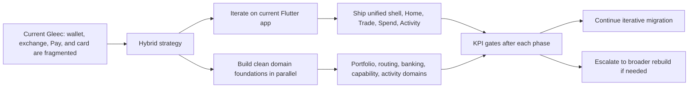
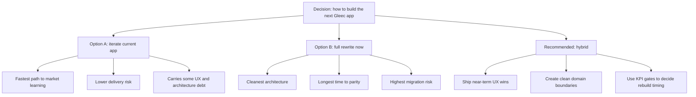
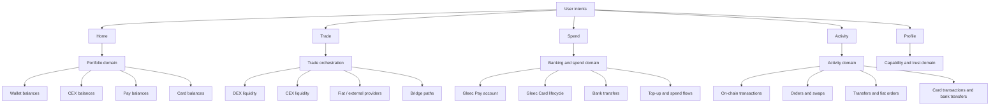
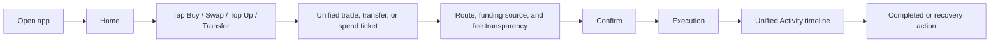
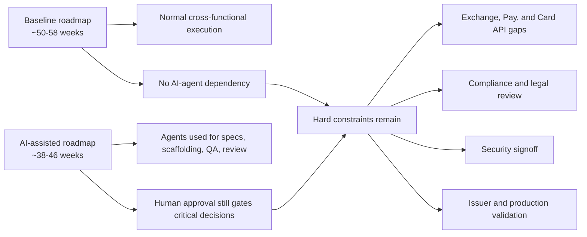
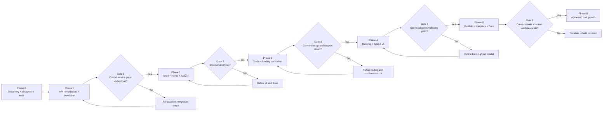
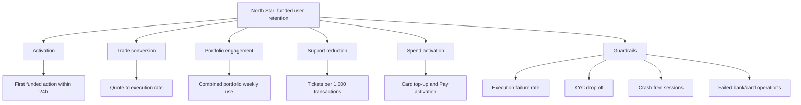

# Gleec Unified App Executive Brief (DEX + CEX + Pay + Card)

Date: March 2, 2026
Audience: Executive team, product leadership, engineering leadership, design leadership
Status: Draft v2
Related documents:
- [GLEEC_UNIFIED_APP_PLAN.md](/Users/charl/Code/UTXO/gleec-wallet-dev/docs/GLEEC_UNIFIED_APP_PLAN.md)
- [GLEEC_UNIFIED_APP_PRD.md](/Users/charl/Code/UTXO/gleec-wallet-dev/docs/GLEEC_UNIFIED_APP_PRD.md)
- [GLEEC_UNIFIED_APP_UX_SPEC.md](/Users/charl/Code/UTXO/gleec-wallet-dev/docs/GLEEC_UNIFIED_APP_UX_SPEC.md)
- [UNIFIED_GLEEC_APP_PRODUCT_PLAN.md](/Users/charl/Code/UTXO/gleec-wallet-dev/docs/UNIFIED_GLEEC_APP_PRODUCT_PLAN.md)

## Executive Summary

Gleec should move toward a single consumer app that unifies wallet, DEX, CEX, Gleec Pay, Gleec Card, fiat rails, bridge, and support into one coherent experience. The current ecosystem already has broad capability coverage, but it is distributed across separate app surfaces, separate flows, and separate mental models. That makes the ecosystem feel more powerful than seamless.

The recommended path is still not a full rewrite now. It is a phased unification on top of the current Flutter codebase, with clean domain foundations built in parallel where the current architecture is weakest. The difference from the earlier plan is material: the official scope should now explicitly include `Banking and Spend` as a first-class domain, plus a dedicated `API discovery and remediation` phase for Exchange, Pay, and Card systems.

Recommendation:
1. Keep the current app and services as the delivery vehicle for the staged rollout.
2. Reframe the product around `Home`, `Trade`, `Spend`, `Activity`, and `Profile`.
3. Build orchestration domains for portfolio, routing, banking/spend, capability gating, and unified activity.
4. Add an explicit API discovery and remediation phase for Exchange, Pay, and Card before front-end commitments are treated as reliable.
5. Use KPI gates after each phase to decide whether to continue iterative migration or escalate to a broader rebuild.

## Visual Summary

## Why This Matters Now

Current user-facing problem:
- The ecosystem exposes many capabilities, but users have to understand Gleec’s product architecture to use them well.
- Wallet, exchange, fiat, Pay, card, bridge, and support are discoverable as separate destinations rather than one connected financial journey.
- Users likely experience friction when trying to answer simple intent-level questions such as:
- How do I buy this asset?
- What is the best way to convert it?
- Where did my order go?
- Is this in my wallet, my exchange account, my Pay balance, or my card?
- Do I need KYC for this action or not?

Market and product pressure:
- Exodus continues to set user expectations for unified self-custody wallet experiences with integrated swap, fiat, portfolio, support, and trust UX.
- Users increasingly expect route abstraction, clear fee transparency, and one activity timeline across all value movement.
- Gleec has a differentiated opportunity because it can combine DEX, CEX, banking, and card-spend capabilities in one app if the UX removes subsystem boundaries.

## Benchmark Insight From Exodus and Current Gleec Services

Key lessons from current Exodus materials and official Gleec materials:
1. One app shell matters more than one backend model.
2. Fiat and exchange flows work when they are framed as simple user intents.
3. Support content and security education are product features, not documentation afterthoughts.
4. Trust is built through clarity about fees, custody, and transaction status.
5. Region, provider, issuer, and compliance constraints must be designed into the product, not patched in later.
6. Gleec’s own ecosystem creates a larger opportunity than Exodus because Pay and Card can close the loop from earning to spending, but that also increases integration and compliance complexity.

Relevant sources:
- [Exodus mobile wallet](https://www.exodus.com/mobile/)
- [Getting started with Exodus](https://www.exodus.com/support/en/articles/8598609-getting-started-with-exodus)
- [How can I buy Bitcoin and crypto](https://www.exodus.com/support/en/articles/8598616-how-can-i-buy-bitcoin-and-crypto)
- [How do I swap crypto in Exodus](https://www.exodus.com/support/en/articles/8598618-how-do-i-swap-crypto-in-exodus)
- [How do I buy crypto with XO Pay in Exodus](https://www.exodus.com/support/en/articles/10776618-how-do-i-buy-crypto-with-xo-pay-in-exodus)
- [Getting started with Trezor on Exodus Desktop](https://www.exodus.com/support/en/articles/8598656-getting-started-with-trezor-on-exodus-desktop)
- [Gleec Card](https://www.gleec.com/card/)
- [Gleec Pay](https://www.gleec.com/pay)
- [Gleec Exchange API v3](https://api.exchange.gleec.com/)
- [Gleec system monitor](https://exchange.gleec.com/system-monitor)
- [Gleec licenses and regulations](https://exchange.gleec.com/licenses-regulations)

## Strategic Decision

### Recommended strategy: Hybrid unification

Near-term:
- Use the current codebase to ship a new shell and unified flows quickly.

Mid-term:
- Build new domain layers under the shell so the UX becomes clean even if legacy modules still exist behind it.

Long-term:
- Decide on a complete rebuild only if the new unified shell proves demand but the old architecture becomes the main bottleneck.

### Why not a full rewrite now

A rewrite would produce a cleaner architecture, but it would delay learning and duplicate parity work. Gleec already has meaningful wallet, exchange, bridge, Pay, and Card capability. The highest-value move is to improve orchestration, navigation, recovery UX, and service contracts first.

### Strategic options at a glance

## Product Outcome We Want

North Star:
- A user can open Gleec and complete Buy, Swap, Transfer, Add Money, Top Up Card, Send Bank Transfer, or Track Activity without needing to understand whether the flow uses DEX, CEX, Pay, Card, bridge, or fiat-provider rails.

User-visible outcomes:
1. One Home with portfolio, watchlist, and quick actions.
2. One Trade area for Buy/Sell/Convert/Advanced.
3. One Spend area for Gleec Pay, Gleec Card, bank transfers, and card top-ups.
4. One Activity feed for on-chain, fiat, bank, card, internal transfer, and trading states.
5. One portfolio model with custody-aware breakdowns across wallet, CEX, Pay, and Card.
6. One trust layer for fees, risk warnings, support, KYC, and failed-flow recovery.

## Proposed Top-Level Experience

Mobile-first navigation:
1. Home
2. Trade
3. Spend
4. Activity
5. Profile

Design note:
- `Earn` remains in scope, but should initially live as a secondary destination under Home/Portfolio and asset detail instead of competing with Spend for a primary mobile tab.

Core product shifts:
1. Replace subsystem-first navigation with intent-first navigation.
2. Add route ranking so Gleec chooses between DEX, CEX, Pay-funded, card-funded, and provider paths where relevant.
3. Add a unified confirmation card with fees, ETA, route, funding source, and custody impact.
4. Add a unified activity timeline with issue states and recovery actions.
5. Add progressive KYC and capability gating so users can enter with self-custody but unlock CEX, Pay, and Card features when needed.

### Target product model

### Example user journey

## Business Impact Hypothesis

Expected upside:
1. Higher buy and swap conversion through simpler decision paths.
2. Better retention through a more coherent portfolio and activity experience.
3. Lower support volume because users can see status, route, fees, and next steps.
4. Stronger differentiation because Gleec can unify self-custody, exchange, banking, and card-spend behavior in one product.
5. Better cross-sell because wallet users can discover Pay/Card and Pay/Card users can discover trading and self-custody.

## KPI Targets

Primary KPIs:
1. New-user activation rate
2. Quote-to-execution trade conversion rate
3. 30-day retention for funded users
4. Spend activation rate for verified users

Secondary KPIs:
1. Support tickets per 1,000 transactions/orders
2. Median time to successful first buy/swap
3. Weekly combined-portfolio view usage
4. Card top-up completion rate
5. Gleec Pay funded-account activation rate

Guardrails:
1. Execution failure rate
2. KYC drop-off rate
3. Crash-free sessions
4. Failed bank/card operation rate

## Delivery Recommendation

### Phase 0: Product discovery and ecosystem audit
- 6 weeks
- Validate support pain points, analytics gaps, user journeys, and product architecture across wallet, exchange, Pay, and Card

### Phase 1: API remediation and orchestration foundation
- 8-12 weeks
- Audit Exchange, Pay, and Card APIs; close missing contract gaps; define event, ledger, and identity models

### Phase 2: Unified shell, Home, Activity v1
- 8 weeks
- New navigation and read-only unified activity timeline across trading, funding, banking, and card surfaces

### Phase 3: Trade and funding unification v1
- 10 weeks
- Unified Buy/Sell/Convert flows with route selection, funding-source selection, and fee transparency

### Phase 4: Banking and Spend v1
- 10 weeks
- Gleec Pay account surfaces, bank transfers, card overview, and top-up orchestration

### Phase 5: Portfolio, transfers, and Earn unification
- 8 weeks
- Combined portfolio across wallet/CEX/Pay/Card and internal transfer flows across domains

### Phase 6: Advanced and growth
- 8 weeks
- Advanced trading, deeper card controls, statements/disputes, personalization, and notifications

### Timeline assumptions

The current roadmap is now a baseline human-team plan for the broader `wallet + exchange + Pay + card` scope. It does include time for discovery and likely service remediation.

Baseline planning case:
1. Total duration: about 50-58 weeks end to end.
2. Assumes a strong cross-functional team using normal engineering automation and parallel pod delivery.
3. Assumes normal product, design, engineering, QA, analytics, and release workflows.
4. Assumes API discovery and moderate remediation for Exchange, Pay, and Card are included.
5. Assumes no extraordinary provider, issuer, compliance, or security-review blockage beyond normal review cycles.

AI-assisted planning case:
1. Total duration: about 38-46 weeks end to end.
2. Assumes active use of AI agents for PRD-to-ticket expansion, design-spec elaboration, UI scaffolding, analytics instrumentation, QA case generation, regression review, and documentation.
3. Assumes engineering still owns architecture, code review, and release quality.
4. Assumes provider integrations, issuer operations, legal/compliance approval, security signoff, and production rollout remain human-gated.

### Timeline comparison

### Team model and phase assumptions

1. Phase 0 assumes a small definition group: product lead, design lead, engineering lead, analytics lead, and compliance/operations input.
2. Phase 1 assumes a dedicated integration workstream for Exchange, Pay, and Card contracts can move in parallel with shared platform/design-system support.
3. Phase 2 assumes a Core Experience pod can move in parallel with continued integration and platform support.
4. Phase 3 assumes Trade and Funding workstreams run in parallel with continued Core Experience support.
5. Phase 4 assumes a Banking and Spend pod owns card, Pay, issuer workflows, and transaction models.
6. Phase 5 assumes portfolio and transfer work require tighter coordination between wallet, CEX, Pay, Card, and activity domains.
7. Phase 6 assumes a growth-oriented pod can focus on Earn, notifications, and personalization while core teams stabilize prior launches.

### Rollout sequence and decision gates

### KPI model

## Investment Areas Required

1. Product and design
- IA redesign
- New trade, activity, banking, spend, and portfolio flows

2. Engineering
- Orchestration layer
- Unified activity model
- Banking and spend domain
- Capability matrix and regional gating
- Shared transaction identity model

3. Operations and compliance
- Region-by-region capability ownership
- Card issuer and banking-partner operations
- Provider escalation and support runbooks

4. Analytics
- Funnel and failure instrumentation
- KPI dashboarding

## Main Risks

1. Users may be confused by custody differences if labeling is weak.
2. Regional restrictions may create uneven product availability across trading, banking, and card features.
3. Exchange APIs appear mature, but Pay/Card API maturity and event coverage may be weaker or less standardized.
4. Legacy architecture may slow shipping if orchestration boundaries are not enforced.
5. Support may spike during migration if transaction identity remains fragmented across wallet, exchange, Pay, and Card systems.

## Required Executive Decisions

1. Approve the hybrid strategy instead of an immediate full rewrite.
2. Fund the unified shell, banking/spend domain, and API remediation work as top product priorities.
3. Establish a cross-functional pod structure around Core Experience, Trade, Banking/Spend, Funding/Transfers, and Trust.
4. Hold delivery to KPI gates rather than output-only milestones.

## 90-Day Ask

Approve the following for the next 90 days:
1. Discovery, UX architecture, and service contract definition across wallet, exchange, Pay, and Card.
2. Exchange, Pay, and Card API audit with a remediation plan and critical-gap register.
3. Unified shell and Home prototype implementation.
4. Activity timeline and capability matrix groundwork.
5. Route-ranking proof of concept for Buy, Swap, and Card top-up funding selection.

If approved, the result will not just be a nicer wallet. It will be Gleec’s first credible unified consumer product across DEX, CEX, Pay, and Card behavior.
