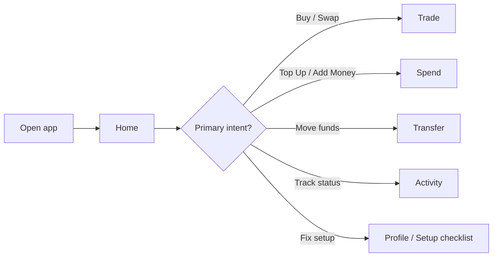
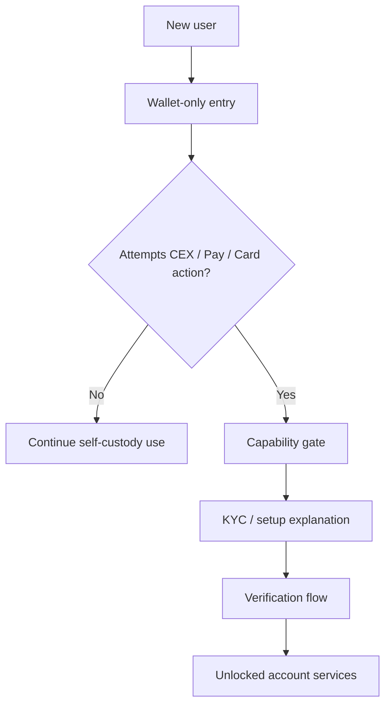
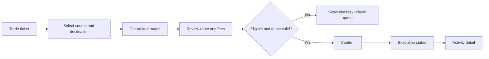
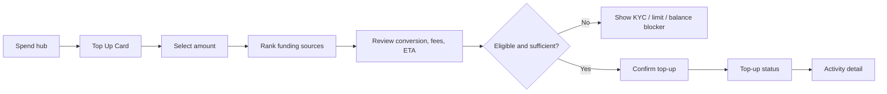
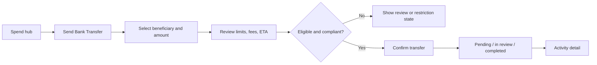
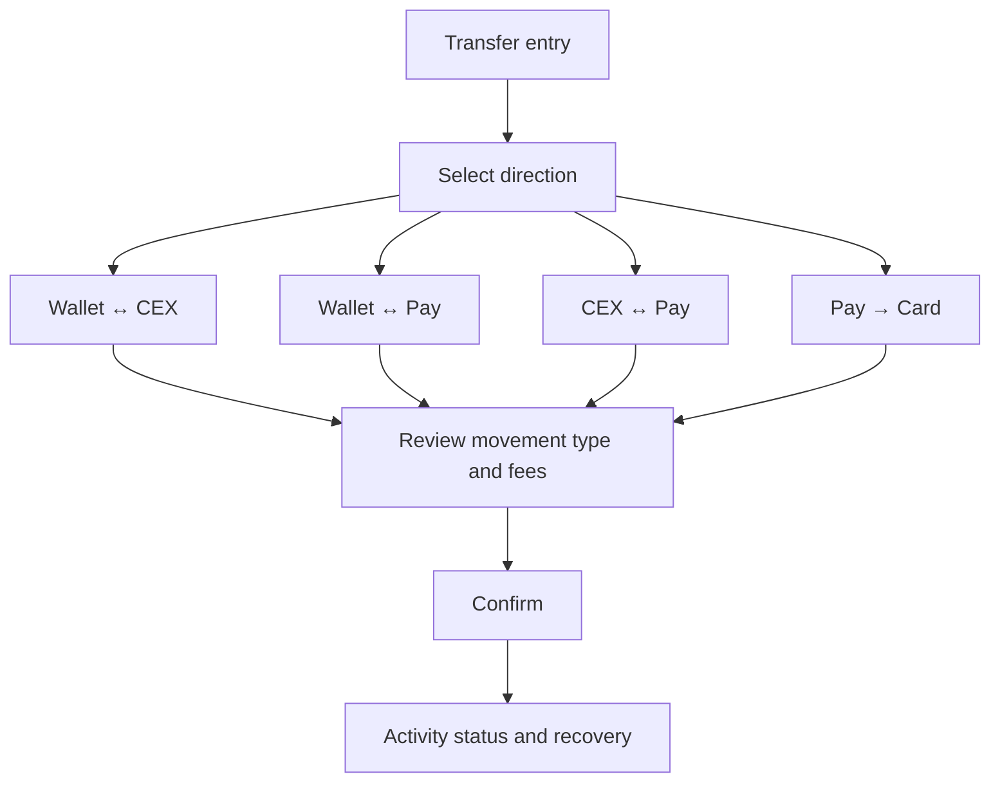
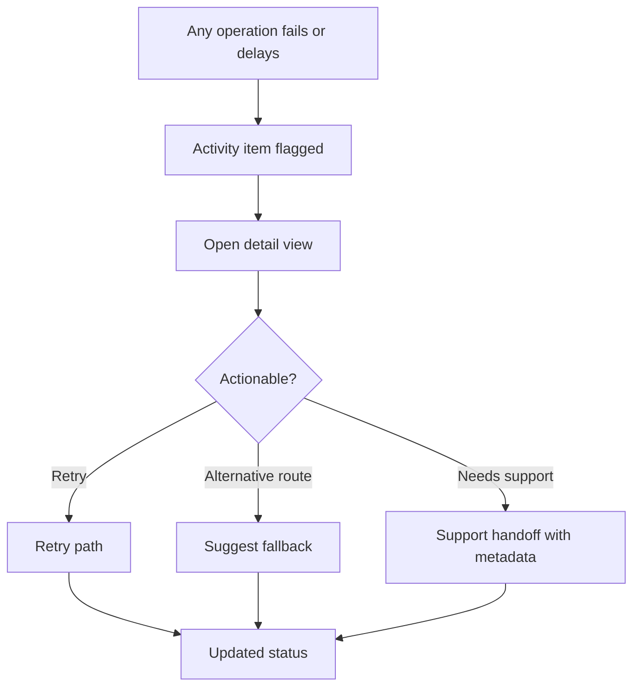

# Gleec Unified App Wireframe Briefs and Flow Diagrams

Date: March 2, 2026
Owner: Product Design
Status: Draft v1
Related documents:
- [GLEEC_UNIFIED_APP_UX_SPEC.md](/Users/charl/Code/UTXO/gleec-wallet-dev/docs/GLEEC_UNIFIED_APP_UX_SPEC.md)
- [GLEEC_UNIFIED_APP_PRD.md](/Users/charl/Code/UTXO/gleec-wallet-dev/docs/GLEEC_UNIFIED_APP_PRD.md)
- [GLEEC_UNIFIED_APP_PLAN.md](/Users/charl/Code/UTXO/gleec-wallet-dev/docs/GLEEC_UNIFIED_APP_PLAN.md)
- [UNIFIED_GLEEC_APP_PRODUCT_PLAN.md](/Users/charl/Code/UTXO/gleec-wallet-dev/docs/UNIFIED_GLEEC_APP_PRODUCT_PLAN.md)

## 1. Purpose

This document translates the UX spec into design-production briefs. It is meant for wireframing, low-fidelity flow review, and design sequencing.

This is not a visual-style guide. It is a structural and behavioral brief for:
- frame creation
- state coverage
- flow mapping
- review sequencing
- handoff readiness

## 2. Design Principles for Wireframes

1. Lead with user intent, not subsystem branding.
2. Always show custody and account context.
3. Balance-first design: users need to know where funds are before choosing an action.
4. Any money movement flow needs pre-confirm transparency.
5. Delays, failures, and restricted states must be designed at the same fidelity as success paths.
6. Spend flows should feel equal to trading flows, not buried in settings.

## 3. Navigation Model to Design

Mobile primary tabs:
1. `Home`
2. `Trade`
3. `Spend`
4. `Activity`
5. `Profile`

Desktop secondary expansion:
1. `Assets`
2. `Earn`
3. `NFTs`
4. `Support`

## 4. Deliverable Order

Design package order:
1. Shell and Home
2. Trade simple flow
3. Spend hub and card/pay overview
4. Activity timeline and detail
5. Transfers and top-up flows
6. Portfolio and detail screens
7. Profile, security, and KYC gating
8. Advanced trading and secondary modules

## 5. Required Flow Diagrams

### 5.1 App entry to action



### 5.2 Progressive unlock model



### 5.3 Buy / convert flow



### 5.4 Card top-up flow



### 5.5 Bank transfer flow



### 5.6 Unified transfer flow



### 5.7 Failure and recovery pattern



## 6. Wireframe Package A: Shell and Home

### Objective

Establish the global product model, cross-domain discoverability, and balance-first landing experience.

### Required frames

1. Mobile app shell, default state
2. Mobile app shell with Spend gated
3. Desktop shell with expanded sidebar
4. Home, funded user
5. Home, unfunded user
6. Home, hidden-balances state
7. Home, unresolved issue state
8. Home, verified user with Spend enabled

### Required components

1. Top app bar with account state
2. Bottom nav
3. Portfolio hero
4. Balance split filter
5. Quick actions row
6. Setup checklist card
7. Needs-attention card
8. Holdings preview
9. Market preview

### Required decisions

1. Whether balance split uses tabs, chips, or segmented control
2. Whether quick actions are fixed or horizontally scrollable on smaller devices
3. How prominently unresolved issues appear
4. Where `Earn` is surfaced without taking a primary tab slot

### Review focus

1. Does Home explain the entire product in one glance?
2. Is Spend discoverable enough for eligible and ineligible users?
3. Is setup guidance useful without overwhelming the first session?

## 7. Wireframe Package B: Trade Simple Flow

### Objective

Design one consumer-grade trade experience that can abstract DEX, CEX, provider, and Pay-funded paths.

### Required frames

1. Trade hub, default simple state
2. Empty ticket
3. Quoted ticket with recommended route
4. Ticket with multiple route options expanded
5. Ticket with KYC gate
6. Ticket with insufficient balance
7. Confirmation state
8. Quote expired state
9. Submitted status
10. Delayed/failed status

### Required components

1. Intent selector: Buy / Sell / Convert
2. Source selector with account context
3. Destination selector
4. Amount input
5. Route summary card
6. Expandable route details
7. Confirmation sheet/card
8. Status progress pattern

### Required decisions

1. Whether route comparison is inline or sheet-based
2. Whether source and destination are separate full-screen selectors or bottom sheets
3. How much route detail to expose by default for beginners
4. Where to surface Pay balance as a valid funding source

### Review focus

1. Can a beginner understand why one route is recommended?
2. Does the user always know where funds are coming from and going to?
3. Can the same pattern handle both provider buy and crypto-to-crypto conversion?

## 8. Wireframe Package C: Spend Hub and Overview Screens

### Objective

Make Gleec Pay and Gleec Card feel like native, primary product surfaces.

### Required frames

1. Spend hub, locked/gated
2. Spend hub, eligible but no card yet
3. Spend hub, eligible with active Pay and Card
4. Card overview, active card
5. Card overview, frozen card
6. Card overview, no card ordered
7. Pay overview, active account
8. Pay overview, verification required

### Required components

1. Spend hero with Pay and Card balances
2. Spend action cluster
3. Eligibility/verification card
4. Card status panel
5. Pay status panel
6. Recent spend activity list
7. Cross-linking between Pay and Card actions

### Required decisions

1. Whether Card and Pay live in one tab with segmented views or stacked cards
2. How to differentiate `Add Money`, `Top Up`, and `Send Transfer`
3. How to visualize card status without using issuer-specific jargon

### Review focus

1. Does Spend feel like a primary destination, not a buried financial settings page?
2. Is the unlock path clear when Pay/Card are not yet available?
3. Are top-up and bank-transfer entry points obvious enough?

## 9. Wireframe Package D: Top-Up, Bank Transfer, and Receive Flows

### Objective

Design money movement flows that feel trustworthy and operationally clear.

### Required frames

1. Card top-up source selection
2. Card top-up quote/review
3. Card top-up blocked by KYC/limits
4. Bank transfer composer
5. Bank transfer review
6. Bank transfer under-review state
7. Receive / Add Money page
8. Pay-to-crypto conversion entry where supported

### Required components

1. Funding source selector
2. Source recommendation card
3. Conversion/FX summary
4. Fees and ETA block
5. Beneficiary selector/entry
6. IBAN details block
7. Capability gate pattern

### Required decisions

1. Whether top-up source selection is list-based or account-card based
2. Whether bank-transfer review is a dedicated screen or sticky bottom summary
3. How to label internal vs external movement clearly
4. Whether to show card and Pay balances together on these flows

### Review focus

1. Does the user understand the tradeoff between funding sources?
2. Are limits and compliance-review states understandable before confirmation?
3. Can these flows scale to multiple currencies and regions without redesign?

## 10. Wireframe Package E: Activity and Recovery

### Objective

Create one activity model that can hold crypto, bank, and card behaviors without looking inconsistent.

### Required frames

1. Activity list, all items
2. Activity filtered to failed/needs action
3. Activity filtered to card
4. Activity filtered to banking
5. Activity detail, successful trade
6. Activity detail, delayed top-up
7. Activity detail, bank transfer under review
8. Activity detail, failed movement with support CTA

### Required components

1. Normalized item row
2. Status badge system
3. Lifecycle stepper
4. Identifier module
5. Support handoff module
6. Recovery CTA group

### Required decisions

1. How much variance item rows can show by activity type
2. Whether unresolved items pin above recent successful items
3. How to display multiple identifiers without clutter

### Review focus

1. Does the user always know what happened and what to do next?
2. Can support rely on this layout to reduce lookup work?
3. Is the timeline still easy to scan with mixed card, bank, and crypto actions?

## 11. Wireframe Package F: Portfolio and Detail Screens

### Objective

Show one coherent money graph across wallet, CEX, Pay, Card, and Earn.

### Required frames

1. Combined portfolio
2. Wallet-only portfolio
3. CEX-only portfolio
4. Pay-only balances
5. Card-only balances/state
6. Detail screen for crypto asset
7. Detail screen for Pay balance
8. Detail screen for Card balance/state

### Required components

1. Portfolio hero
2. Split filter
3. Holdings/balance list
4. Account breakdown rows
5. Action cluster
6. Recent activity module

### Required decisions

1. Whether Pay/Card appear inside the same list model as crypto assets or as account-level rows
2. How to prevent apparent duplication when value exists across multiple surfaces
3. How much charting is relevant for non-asset balances like Pay/Card

### Review focus

1. Can users understand where all money sits without reading docs?
2. Does the model help users decide what to do next?
3. Is the combined view comprehensible for hybrid users?

## 12. Wireframe Package G: Profile, Security, and KYC

### Objective

Make trust operations clear while preserving progressive onboarding.

### Required frames

1. Profile overview
2. Verification status page
3. Security center
4. Capability-gated entry state from Spend
5. KYC explanation sheet/page
6. Setup checklist state progression

### Required components

1. Verification summary card
2. Security summary card
3. Wallet recovery health module
4. Account-services security module
5. Region/legal info module
6. Support entry point

### Required decisions

1. Whether KYC prompting is modal, page-based, or step-sheet based
2. How to explain custody differences without too much copy
3. How to separate wallet security from account/Pay/Card security visually

### Review focus

1. Does Profile explain what the user has unlocked?
2. Are security responsibilities between self-custody and custodial services clearly separated?
3. Is KYC framed as feature unlock rather than generic bureaucracy?

## 13. Suggested Low-Fidelity Layout Sketches

### 13.1 Home

```text
┌─────────────────────────────────────┐
│ Total Balance                       │
│ $24,580.12   +2.4%                  │
│ [Combined][Wallet][CEX][Pay][Card]  │
├─────────────────────────────────────┤
│ [Buy] [Swap] [Transfer] [Top Up]    │
│ [Add Money]                         │
├─────────────────────────────────────┤
│ Setup checklist / Needs attention   │
├─────────────────────────────────────┤
│ Holdings preview                    │
├─────────────────────────────────────┤
│ Market movers                       │
└─────────────────────────────────────┘
```

### 13.2 Trade ticket

```text
┌─────────────────────────────────────┐
│ [Buy][Sell][Convert]                │
│ From                                │
│ USDT · Pay balance      $1,250      │
│ To                                  │
│ BTC · Wallet                        │
│ Amount                              │
│ $500                                │
├─────────────────────────────────────┤
│ Recommended route                   │
│ CEX instant conversion              │
│ Fees $1.25 · ETA < 30 sec           │
│ [See route details]                 │
├─────────────────────────────────────┤
│ [Review]                            │
└─────────────────────────────────────┘
```

### 13.3 Spend hub

```text
┌─────────────────────────────────────┐
│ Spend                               │
│ Pay €3,450      Card $1,247         │
├─────────────────────────────────────┤
│ [Top Up Card] [Send Transfer]       │
│ [Add Money] [View IBAN]             │
├─────────────────────────────────────┤
│ Eligibility / setup                 │
├─────────────────────────────────────┤
│ Recent spend activity               │
└─────────────────────────────────────┘
```

### 13.4 Card top-up

```text
┌─────────────────────────────────────┐
│ Top Up Card                         │
│ Amount: $200                        │
├─────────────────────────────────────┤
│ Recommended source                  │
│ USDT · Wallet        Best rate      │
│ Other sources                       │
│ EUR · Pay                           │
│ BTC · Wallet                        │
├─────────────────────────────────────┤
│ Fees / FX / ETA                     │
├─────────────────────────────────────┤
│ [Confirm Top Up]                    │
└─────────────────────────────────────┘
```

### 13.5 Activity detail

```text
┌─────────────────────────────────────┐
│ Card top-up                         │
│ Pending                             │
├─────────────────────────────────────┤
│ Step 1 Submitted        Done        │
│ Step 2 Conversion       Done        │
│ Step 3 Card funding     Pending     │
├─────────────────────────────────────┤
│ Amount $200                         │
│ Source USDT · Wallet                │
│ Reference abc-123                   │
├─────────────────────────────────────┤
│ [Retry] [Contact Support]           │
└─────────────────────────────────────┘
```

## 14. Handoff Checklist for Design

A wireframe package is ready for visual design when:
1. Happy path, empty state, blocked state, and failure state all exist.
2. All money movement screens show custody and funding context.
3. KYC and regional gating are represented before submission, not after.
4. Activity detail has identifiers and recovery actions.
5. Profile/Security explains wallet vs account responsibilities.

## 15. Review Cadence Recommendation

1. Review Package A and B first with Product, Design, and Engineering.
2. Review Spend and Activity together, because they share the trust/recovery model.
3. Review Portfolio only after Home and Activity model are stable.
4. Review Profile/KYC with compliance and support in the room.
