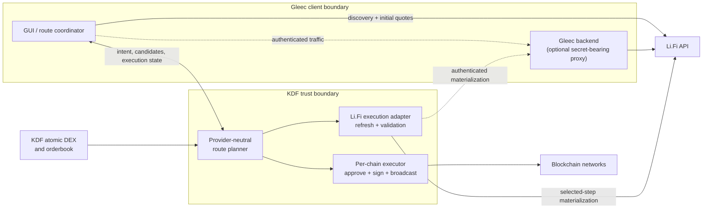

# Li.Fi–KDF integration architecture decision

## Document control

| Field | Value |
| --- | --- |
| Status | **Proposed** — architecture and planning only; no interface described here is implemented |
| Decision owners | Gleec Wallet engineering and KDF engineering |
| Consulted teams | Flutter SDK, product, security, QA, and operations |
| Research baseline | **2026-07-15** |
| Review date | **2026-07-29**, and again before any public RPC contract is frozen |
| Decision scope | Li.Fi as an external-liquidity source for Gleec Trade/DEX |

Research was performed against these dated local references:

- `gleec-wallet-card`, including the in-progress Gnosis Pay architecture.
- `komodo-defi-framework` branch `feat/tron-gasfree-gui-tweaks` at
  `bfd7f7ee3`.
- KDF Gnosis branch `origin/feat/safe-smart-wallet` at `5be59af67` and
  [KDF PR #6](https://github.com/GLEECBTC/kdf-internal/pull/6).
- `komodo-docs-mdx` branch `feat/add-tron-documentation` as inspected on the
  research baseline date.
- Current official Li.Fi documentation linked throughout this document.

These branch and content observations are evidence as of the research baseline,
not promises about later branch state.

Affected repositories:

| Repository | Intended role |
| --- | --- |
| `gleec-wallet-card` | User intent, route comparison and consent, route-level persistence, status UX, and recovery actions |
| `komodo-defi-framework` | Provider-neutral route evaluation, execution-critical validation, key selection, approvals, signing, broadcasting, and on-chain receipts |
| `komodo-defi-sdk-flutter` (downstream) | Typed wrappers over accepted KDF contracts; no separate execution policy |
| `komodo-docs-mdx` | Future public RPC and lifecycle documentation after KDF contracts are implemented and accepted |
| Optional Gleec backend | Secret-bearing Li.Fi proxy if authenticated production limits are required |

The issue-ready KDF work is specified in the
[KDF implementation handoff](https://github.com/GLEECBTC/kdf-internal/blob/main/docs/LIFI_INTEGRATION_HANDOFF.md)
at `komodo-defi-framework/docs/LIFI_INTEGRATION_HANDOFF.md`.

## Executive decision

1. **Li.Fi supplements KDF trading; it does not replace it.** Existing KDF
   atomic DEX/orderbook routes remain first-class candidates and remain the only
   route family for assets outside the safe KDF/Li.Fi overlap.
2. **Support three route families:** direct KDF atomic swaps, standalone Li.Fi
   routes, and mixed routes with Li.Fi before and/or after a KDF atomic swap.
3. **Use a hybrid ownership model for the first production integration.** The
   GUI or Gleec backend owns discovery, initial quotes, route presentation, and
   route-level recovery. KDF owns the execution-critical provider refresh,
   intent validation, approvals, signing, broadcasting, and chain receipts.
4. **V1 launches with KDF-managed software-key EVM EOAs.** Gnosis Safe/card
   funds, hardware wallets, new WalletConnect behavior, and message-signing
   routes are outside V1. A future non-EVM adapter would use the equivalent
   native KDF software-key account; `EOA` is used only for EVM accounts.
5. **Calculate coverage at runtime.** A Li.Fi route is eligible only where the
   activated KDF asset, KDF trading capability, current Li.Fi chain/token
   connection, and implemented KDF source-chain executor all agree.
6. **Never auto-execute a ranked route.** Compare net expected receive after
   provider, gas, and KDF fees; show ETA and execution risk separately; require
   explicit user consent.

Case A (KDF owns the full Li.Fi workflow) and Case B (the GUI owns Li.Fi and KDF
only performs chain operations) are not mutually exclusive implementations.
They are ownership profiles over a shared route model and chain executor. The
hybrid deliberately combines them at an execution boundary rather than
building two stacks.

### Li.Fi product surface in scope

V1 integrates the classic `https://li.quest/v1` REST workflow only:

- `/chains`, `/tokens`, `/connections`, and `/tools` for capability discovery.
- `/quote` and `/advanced/routes` for route discovery.
- `/advanced/stepTransaction` for selected-step materialization.
- `/status` for classic transfer status and recovery.

Li.Fi Intents/Solver APIs and `order.li.fi` are a separate execution and status
model and are excluded. Composer, arbitrary contract calls, and message-based
execution are also excluded. The allowed provider origin and path family must
be fixed in the adapter or routed through a Gleec-controlled proxy; neither the
GUI nor an RPC caller may supply an arbitrary provider URL.

## Why a boundary is necessary

Li.Fi exposes discovery endpoints, one-step quotes, advanced multi-step routes,
per-step transaction materialization, and transfer status. A `/quote` can
include ready-to-sign transaction data, while an advanced route requires
materializing transactions for its individual steps. See Li.Fi's
[endpoint specification](https://docs.li.fi/agents/reference/endpoint-specs).

Execution is therefore a workflow rather than one signing call. Li.Fi's SDK
executor manages allowance and balance checks, chain switching, transaction
retrieval and submission, status tracking, and exchange-rate changes that may
require renewed consent. See
[Execute Routes/Quotes](https://docs.li.fi/sdk/execute-routes).

Gleec cannot use that workflow as an opaque signer because KDF controls the
keys. Conversely, duplicating all provider discovery and lifecycle behavior in
KDF would add a large provider-specific maintenance surface. The hybrid keeps
the user and product workflow in the client while putting the irreversible
chain boundary beside the keys and KDF's chain implementations.

## Current KDF groundwork and gaps

### 1inch provider client

KDF already contains a typed 1inch client and experimental RPCs. The current
`one_inch_v6_0_classic_swap_create_rpc` in
`komodo-defi-framework/mm2src/mm2_main/src/rpc/lp_commands/one_inch/rpcs.rs`
returns contract-call transaction data for the GUI to sign. Its source comment
also states that KDF does not verify that transaction and trusts the 1inch API.

This proves that KDF can host an aggregator adapter, but the trust model is not
sufficient for Li.Fi production execution. The reusable concept is the provider
client boundary, not the unverified transaction handoff.

### Liquidity-routed swaps

The current `lr_swap` code in
`komodo-defi-framework/mm2src/mm2_main/src/rpc/lp_commands/lr_swap.rs` already
describes external liquidity before or after an atomic swap. It is the right
conceptual starting point for mixed routes, but it is not an execution
foundation yet:

- Only the ask-side/pre-route subset is implemented; the comments and types
  still expose incomplete or inconsistent buy/sell semantics.
- Bid-side and post-route behavior are not implemented.
- Full fee reporting remains a TODO.
- Quote-for-token and routed-trade execution RPCs still call `todo!()`.
- Public LR types directly contain 1inch `ClassicSwapDetails`; the
  `LrExecuteRoutedTradeRequest` in
  `komodo-defi-framework/mm2src/mm2_main/src/rpc/lp_commands/lr_swap/types.rs`
  itself notes that a provider-neutral enum is needed.

Li.Fi work should finish the provider-neutral model rather than add a second
provider-specific LR path.

### Generic EVM signing

The existing public `sign_raw_transaction` RPC accepts
`SignEthTransactionParams` in
`komodo-defi-framework/mm2src/coins/lp_coins.rs`, including value, destination,
calldata, gas limit, and gas-price policy. The `sign_raw_eth_tx` implementation
in `komodo-defi-framework/mm2src/coins/eth.rs` signs with the coin's active
address and chain configuration. It does not accept an explicit address
selector or expected chain ID, bind the payload to a confirmed trade intent,
simulate the intended call, or provide a typed receipt/revert lifecycle.

That surface is adequate for a narrow EVM/EOA prototype in Case B. It must not
be treated as the production Li.Fi security boundary.

### HTTP transport

The inspected KDF feature branch includes cross-platform POST-with-headers
support in `komodo-defi-framework/mm2src/mm2_net/src/transport.rs`, with native
and WASM implementations. The relevant helper commit was present on the
inspected Tron/Gnosis feature lineage but not on the inspected
`origin/dev`/`origin/main` lineage. Landing or backporting that transport is a
prerequisite if the Li.Fi implementation targets a branch that does not yet
contain it; no additional transport abstraction is otherwise required.

## Gnosis groundwork assessment

[KDF PR #6](https://github.com/GLEECBTC/kdf-internal/pull/6) establishes a
useful ownership precedent: the Gnosis API remains outside KDF, while KDF owns
local key selection, registered Safe/Delay validation, and EIP-191/EIP-712
signing. That same principle supports keeping Li.Fi discovery and product
workflow outside KDF while placing execution validation beside the signer.

The PR is **not** a Li.Fi executor:

- Its registry represents Gnosis Pay card Safes and their verified Delay
  relationship, not arbitrary user-selected accounts.
- Its card/module allowlist intentionally rejects unsupported calldata rather
  than authorizing general aggregator calls.
- Typed-data signing serves canonical Gnosis card operations. Initial Li.Fi V1
  uses ordinary on-chain transaction execution and excludes permits or other
  message-signing routes.
- Existing EOA approval and transaction signing cannot move funds owned by a
  Safe.

Therefore the Gnosis work contributes a verified-intent pattern and signing
primitives, but its Safe registry and card policies must not be reused as Li.Fi
authorization. Safe/card funding remains deferred.

As of **2026-07-15**, no Gnosis Pay or Safe-specific pages, matching branch
names, or matching content were found in the inspected public
`komodo-docs-mdx` checkout. Public Li.Fi documentation must likewise wait until
the proposed KDF contracts are implemented and accepted.

## Ownership options

| Concern | Case A: KDF owns Li.Fi | Case B: GUI owns Li.Fi | Recommended hybrid |
| --- | --- | --- | --- |
| Chain/token/tool discovery | KDF | GUI or backend | GUI or backend |
| Initial quote and route search | KDF | GUI or backend | GUI or backend |
| Selected-step refresh/materialization | KDF | GUI | **KDF** from canonical intent/selected step |
| Candidate comparison and user presentation | KDF supplies and ranks; GUI presents | GUI | Shared neutral candidates; GUI presents |
| Route orchestration | KDF route task | GUI coordinator | GUI route coordinator; KDF executes one external stage safely |
| Route-level persistence | KDF durable store | GUI durable store | GUI durable store |
| Transaction idempotency journal | KDF | KDF only if using a hardened executor | KDF |
| Allowance and approval | KDF | GUI requests generic KDF chain calls | KDF policy and execution |
| Signing and broadcasting | KDF | KDF generic chain RPCs | KDF typed external executor |
| On-chain receipt/revert state | KDF | GUI polls through KDF/RPC | KDF typed receipt |
| Li.Fi transfer status and recovery UX | KDF polls; GUI renders | GUI | GUI/backend polls; KDF supplies chain evidence |
| API key | Unauthenticated KDF calls or Gleec backend proxy; never client-distributed KDF config | Backend proxy; never Flutter | Backend proxy; never Flutter or local KDF |
| Security posture | Strongest single owner, if KDF fully validates provider data | Highest blind-sign/stale-payload risk | Strong validation without full provider workflow duplication |
| Maintenance cost | Highest; duplicates a multi-chain workflow SDK in Rust | Lowest KDF cost; highest GUI execution complexity | Moderate; one provider adapter plus neutral executor |

### Case A: complete KDF abstraction

Case A requires KDF to own the Li.Fi client, discovery cache, route quoting,
step materialization, approvals, multi-step execution, rate-change consent,
status polling, partial/refund handling, and durable restart recovery. It also
requires a safe executor for every advertised source ecosystem.

The GUI still supplies explicit route-level semantic consent containing the
complete per-external-stage consents and atomic order guards. A candidate or
quote digest identifies what was shown but is not execution authorization.
For an advanced Case A route, KDF retains the bounded full Li.Fi Step in its
evaluation snapshot and the consent references it by evaluation, candidate,
stage, and digest; the raw Step need not be exposed to the GUI.

This remains a supported future profile for consumers that cannot coordinate a
route themselves. It is not the first production target because it makes KDF
responsible for provider UX policy and duplicates much of Li.Fi's changing
workflow behavior.

### Case B: chain operations only

For an EVM software EOA, the GUI can call Li.Fi REST endpoints and adapt the
returned transaction to KDF's current allowance, approval, sign, and broadcast
RPCs. That can validate feasibility without a Li.Fi-specific KDF client.

Pure Case B is not the production default. A client-provided calldata blob has
no cryptographic binding to the quote the user reviewed. KDF can check its
shape, simulate it, and constrain its sender/chain, but cannot know that it is
the currently selected provider step unless it refreshes or independently
materializes that step.

### Hybrid: selected production baseline

The GUI or backend owns the high-churn control plane: discovery, initial route
search, presentation, route-level persistence, Li.Fi status polling, and user
recovery. KDF owns the irreversible data plane: refresh/materialization of the
selected external step, canonical-intent comparison, approval planning,
simulation, signing, broadcast, idempotency, and receipts.

For a simple route, KDF should reissue `/quote` from the canonical intent where
possible. For an advanced route, `/advanced/stepTransaction` requires the full
selected `Step` supplied by the client. KDF must treat that step as untrusted,
validate its action and tool fields, and bind the returned transaction envelope
to the canonical intent. The Li.Fi response is not an independent or signed
attestation. If refresh or materialization fails, KDF must fail closed rather
than silently downgrade to `ClientMaterializedTransaction`.

Case A and Case B remain composable with this foundation:

- Full provider discovery and a route task can later be added above the same
  KDF adapter to produce Case A.
- An explicitly client-materialized transaction can enter the same hardened
  executor for controlled Case B uses, with its reduced assurance surfaced.
- A single route must have one declared owner for materialization and route
  state. The GUI and KDF must not concurrently advance the same step.

## Hybrid topology



The dotted backend paths are optional. If authenticated Li.Fi limits are
needed, the GUI and KDF adapter use the Gleec backend proxy; the API key never
crosses into the app or local KDF. Li.Fi states that its API can be used
without a key and that keys provide higher limits. See
[Rate Limits and API Authentication](https://docs.li.fi/api-reference/rate-limits).
A client-distributed process cannot protect a fleet-wide secret.

## Route model and user contract

A route candidate is an ordered list of stages with a canonical input/output,
fees, minimum receive, expiry, ETA, and warnings.

| Route family | Stage shape | Product behavior |
| --- | --- | --- |
| Direct KDF | KDF atomic swap | Preserve current atomic DEX/orderbook behavior |
| Standalone Li.Fi | One or more Li.Fi swap/bridge steps | Display provider, chains, tokens, fees, minimum receive, and recovery path |
| Mixed pre-route | Li.Fi → KDF atomic swap | External stage obtains the maker-order input asset |
| Mixed post-route | KDF atomic swap → Li.Fi | External stage converts or bridges the atomic-swap output |
| Mixed both sides | Li.Fi → KDF atomic swap → Li.Fi | Execute and persist each stage independently |

**Mixed routes are sequential and are not atomic end-to-end.** The atomic leg
does not roll back a completed Li.Fi leg, and a later Li.Fi failure does not
reverse a completed atomic swap. The confirmation screen must say this before
the first irreversible action. Activity and recovery views must always show:

- The last finalized stage and its transaction/order identifiers.
- The asset, amount, chain, and address currently holding recoverable funds.
- Whether the next action is automatic, requires refreshed consent, can be
  retried, or needs manual support.

Route ranking starts from the provider's minimum receive (`toAmountMin`), not
its optimistic output. It must honor whether each `feeCosts` entry is already
included and must not subtract an included fee twice. Gas or KDF fees paid in a
different asset require a named valuation source and timestamp; if no reliable
conversion exists, the candidate is marked unrankable rather than assigned a
fabricated net value. ETA, number of irreversible stages, bridge/provider
exposure, and recovery risk are separate dimensions; they must not be collapsed
into the numeric price rank.

For a mixed pre-route, KDF must revalidate the selected maker order, available
volume, and acceptable price immediately before signing the irreversible Li.Fi
stage. That check does not reserve the order: the maker can still disappear
while the pre-route settles. The user must see this residual risk. If it occurs,
the route stops and recovery presents the acquired intermediate asset as a real
holding that can be rerouted, traded through another order, or retained.
KDF must revalidate the maker order again immediately before the atomic fill.
For the hybrid, the GUI/SDK calls the existing KDF `buy`/`sell` path with a
proposed optional route guard that restricts matching to the same order UUID,
pair, side, side-aware limit price, and volume, uses fill-or-kill behavior, and
expires. Taking an ask requires the live ask at or below the maximum limit;
taking a bid requires the live bid at or above the minimum limit. KDF
returns a durable one-time guard reference only after the pre-route source
transaction confirms. The later fill must present that reference and the
identical guard; KDF loads the consent journal, atomically consumes the guard
into one taker-order UUID, and returns that same order on retry. It checks the
live guard inside the taker-order path immediately before broadcast.
Case A uses the same internal hook. Existing callers that omit the optional
guard remain compatible. A successful pre-route never authorizes filling a
disappeared or changed order.

## Security model

### Canonical route and stage consent

Before any external call is signed, KDF receives or derives an immutable intent
containing at least:

- Source and destination KDF tickers plus their chain/token identities.
- Exact route source amount and minimum output, plus each external stage's
  expected output shown at consent, stage minimum, and maximum
  expected-output degradation for a refresh.
- Explicit KDF address selector, resolved sender, and destination recipient.
- Selected route/stage identity, exact selected provider tools, tool
  restrictions, and quote expiry.
- Aggregate non-network fee limits per fee type/asset and one aggregate network
  fee cap across reset, approval, and main transactions.

The GUI may display richer provider data, but the values above form the semantic
signing contract. A refresh can proceed without another prompt only when exact
identities, recipient, selected tools, and stage topology are unchanged; the
refreshed expected output remains above both the minimum and the consented
degradation floor; every fee limit holds; and the consent remains unexpired.
An improvement inside those bounds may proceed. Any violation pauses before
signing. Output/fee-bound violations return an economics-only replacement
summary for explicit new consent. A tool, ordered topology, advanced-step
identity, asset, sender, recipient, or amount change cannot be accepted in
place; it requires a fresh route evaluation or fails closed.

Stage- and route-scoped semantic consent digests cover this contract because
exact transaction envelopes do not exist until KDF materializes the selected
step. After materialization, KDF persists a versioned action-plan digest over
ordered reset/approval/main action intents. It then derives nonce and final fee
fields just in time for each action, persisting an immutable per-action execution
digest before that signature. Unsigned later actions may be replanned after a
required receipt; signed action records never change. Consent, action-plan,
and per-action digests serve different purposes and must not be conflated.

### Execution checks

Immediately before approval or signing, KDF must:

1. Resolve the requested KDF account and require it to match the transaction
   sender.
2. Require the source chain and activated coin configuration to match the
   transaction chain.
3. Compare source/destination token, amount, recipient, contract target, native
   value, minimum output, provider/tool policy, and expiry to the canonical
   intent and refreshed step.
4. Use only the fixed/allowlisted classic `li.quest/v1` provider origin or a
   Gleec proxy; reject client-supplied endpoints and authorization headers.
5. For a mixed pre-route, revalidate its atomic maker order, price, and volume
   before the external transaction becomes irreversible; then require the same
   one-time journal-backed guarded `buy`/`sell` contract to recheck it
   immediately before atomic-fill broadcast.
6. Simulate or estimate through the selected chain implementation where
   supported, and reject a deterministic revert.
7. Persist the execution/idempotency record before broadcast, then return a
   typed receipt state rather than treating a transaction hash as success.

Provider transport must bound response and calldata sizes, apply explicit
timeouts and bounded backoff (including HTTP 429 handling), and sanitize errors
and telemetry so API keys, authorization headers, and raw provider payloads are
not exposed.

KDF must never sign a transaction merely because its bytes came from the GUI or
Li.Fi.

### Approvals

Li.Fi instructs integrators to use the `approvalAddress` returned by the quote,
not a hard-coded spender, and documents tokens such as USDT that may require an
allowance reset to zero. See
[Token Approvals](https://docs.li.fi/agents/workflows/approvals).

The Gleec defaults are:

- Native assets require no token approval.
- ERC-20 approval uses the execution step's validated spender.
- Approve the exact required amount by default; unlimited approval is not part
  of V1.
- Determine zero-reset semantics from reviewed chain-and-contract policy or a
  failed/simulated direct approval, never from the token symbol alone. When a
  reset is required and the allowance is non-zero, confirm the reset receipt
  before submitting the exact approval.
- Confirm every required approval before the main transaction.

### Provider trust boundary

Li.Fi remains a trusted routing provider over TLS. Classic Li.Fi quote and step
responses are not cryptographically signed attestations. KDF refreshing a step
and comparing it with the user's structural and economic bounds reduces stale
or client-altered payload risk, but it does **not** cryptographically prove the
calldata, independently establish the route's economics, or prove that Li.Fi
found the globally best route. Product copy must not describe KDF validation as
independent route attestation.

## Capability and ecosystem policy

Li.Fi currently exposes providers for EVM, Solana, native Bitcoin, Sui, and
Tron, but that list must not be converted into a static Gleec allowlist. See
[Multi-VM Support](https://docs.li.fi/sdk/configure-sdk-providers).

For a route direction to be advertised, all of these conditions must hold:

```text
Li.Fi eligible =
  KDF asset is activated
  AND KDF supports the required trade/orderbook role
  AND Li.Fi currently reports the chain, token, and connection
  AND KDF has a reviewed executor for the source-chain payload type
  AND the active KDF software-key account is supported by the executor
```

Consequences:

- Direct KDF routes remain available when Li.Fi has no overlap.
- Matching ticker symbols are insufficient; chain identity, contract/token
  identity, decimals, and direction must match.
- V1 launches with an EVM EOA executor, and capability flags control exposure.
- Native Bitcoin support requires exact PSBT and output-order validation before
  signing. Other KDF UTXO assets must not be treated as Li.Fi Bitcoin.
- A Solana, Sui, or Tron route is not advertised until KDF has a safe executor
  for Li.Fi's exact transaction representation on that ecosystem.
- Discovery results are cached/debounced but refreshed according to provider
  metadata and rate-limit policy; support is not inferred permanently from a
  prior successful quote.

This policy satisfies the target of enhancing all currently supported KDF
trade/orderbook ecosystems without promising Li.Fi coverage where the provider
or a safe KDF executor does not exist.

## Lifecycle and recovery ownership

The raw classic `/v1/status` response enum includes `NOT_FOUND`, `INVALID`,
`PENDING`, `DONE`, and `FAILED`; a `DONE` transfer can be `COMPLETED`, `PARTIAL`,
or `REFUNDED`. `PARTIAL` means the transfer completed into a different,
typically intermediate token rather than the originally requested token; it
does not by itself mean that only part of the amount arrived. A polling timeout
is not proof of failure. See the
[status endpoint](https://docs.li.fi/api-reference/check-the-status-of-a-cross-chain-transfer)
and [Status & Recovery](https://docs.li.fi/agents/workflows/status-recovery).

In the hybrid:

| Evidence/state | Source of truth | Required behavior |
| --- | --- | --- |
| Selected route and ordered stages | GUI durable route record | Resume at the first non-terminal stage after restart |
| Approval/main transaction submission | KDF idempotency journal | Never rebroadcast blindly after an ambiguous client response |
| Source-chain confirmation or revert | KDF chain receipt | Gate progression to provider tracking or the next stage |
| Li.Fi `NOT_FOUND` or `PENDING` | Li.Fi status plus saved source tx details | Continue/retry polling; retain manual explorer recovery |
| Li.Fi `INVALID` | Li.Fi status plus saved request/tool context | Stop automatic progression; correct a bad hash/tool association or escalate rather than polling indefinitely |
| Li.Fi `DONE/COMPLETED` | Li.Fi status corroborated by destination details | Mark external stage complete |
| Li.Fi `DONE/PARTIAL` | Li.Fi status | Record the alternate/intermediate token and actual amount; require a new route decision without implying an amount shortfall |
| Li.Fi `DONE/REFUNDED` | Li.Fi status | Record the refund asset/location; do not label the original route successful |
| Li.Fi `FAILED` | Li.Fi status and chain evidence | Stop automatic progression and expose support/recovery details |
| Mixed-route intermediate balance | Finalized stage plus KDF balance/receipt | Show its exact asset, chain, and next safe action |

Cancellation is effective only before signed bytes are exposed and before an
irreversible transaction is broadcast. After either boundary, `CancelOutcome`
can only persist `stop_after_current` or report `reconciliation_only`: do not
schedule later route stages or request new signatures, but do not imply an
on-chain rollback. The GUI and KDF must continue reconciliation and status
tracking for every exposed or broadcast transaction. Cancellation is addressed
by the durable execution/route ID, not only an ephemeral task handle. For a
mixed pre-route that has confirmed but whose one-time atomic-fill guard remains
unused, the stop operation atomically revokes that guard and returns
`stop_after_current`; it must still work after task completion or restart.

## Team responsibilities

### Wallet and product

- Persist the canonical route, stage order, consent version, transaction IDs,
  actual intermediate outcomes, and recovery actions.
- Present complete provider, KDF, network, and gas fees without double counting.
- Warn that mixed routes are not atomic end-to-end.
- Offer bounded replacement consent when expected-output/fee limits fail;
  require a fresh evaluation for recipient, exact-tool, amount, identity,
  advanced-step, or stage-sequence changes.
- Never mark a timeout or transaction hash alone as successful.

### Flutter SDK

- Mirror accepted KDF types with immutable typed models.
- Preserve typed errors and task/user-action states; do not flatten them into
  generic strings or maps.
- Keep route policy out of transport wrappers.

### KDF

- Build one provider-neutral route/stage model and one hardened external
  execution boundary shared by 1inch, Li.Fi, Case A, Case B, and hybrid modes.
- Preserve existing atomic DEX/orderbook and 1inch RPC compatibility while
  migrating internals away from provider-specific LR types.
- Own address/chain resolution, execution-critical validation, approvals,
  signing, broadcasting, durable idempotency, and receipts.
- Advertise only capabilities backed by reviewed source-chain executors.

### Backend and operations

- Hold any shared Li.Fi API key and apply rate limiting, redacted telemetry, and
  availability monitoring.
- Never log private keys, signed raw transactions, full authorization headers,
  or sensitive provider payloads unnecessarily.
- Establish support lookup using route ID, source/destination chain, provider
  tool, and transaction hashes.

## Explicitly deferred

- Funding or executing from Gnosis Pay card Safes or other smart accounts.
- Safe deployment/configuration or arbitrary Safe module calls.
- Hardware-wallet execution and expanded WalletConnect behavior.
- Permit, EIP-712, or other off-chain message-signing routes.
- Li.Fi Intents/Solver APIs and the `order.li.fi` lifecycle.
- Li.Fi Composer and beta arbitrary contract-call workflows.
- Unlimited token approvals.
- Automatic execution of the top-ranked route.
- Public `komodo-docs-mdx` RPC pages before the KDF contract is implemented,
  reviewed, and accepted.

## Consequences and review gates

The hybrid reduces blind-signing risk without making KDF reproduce Li.Fi's full
client workflow. It adds a KDF provider adapter, provider-neutral route model,
hardened per-chain executor, durable transaction journal, and cross-team route
state contract. Those are deliberate costs and reusable beyond Li.Fi.

This proposal is ready to enter KDF issue breakdown when all reviewers agree
to the following fixed gates:

1. Hybrid is the first production ownership profile; Case A is an additive
   expansion and pure Case B is limited to controlled/prototype use.
2. KDF-managed software-key EVM EOA execution is the only V1 launch signer
   profile; later non-EVM accounts require their own reviewed adapters.
3. Exact approval, refreshed-step validation, no local shared API key, and
   non-atomic mixed-route disclosure are mandatory controls.
4. Capability exposure is runtime and executor-gated, not a static chain list.
5. The KDF RPC/type contracts remain marked proposed until implemented and
   reviewed; only then are SDK bindings and public API pages produced.

## Authoritative Li.Fi references

- [Endpoint Specifications](https://docs.li.fi/agents/reference/endpoint-specs)
- [Execute Routes/Quotes](https://docs.li.fi/sdk/execute-routes)
- [Token Approvals](https://docs.li.fi/agents/workflows/approvals)
- [Status & Recovery](https://docs.li.fi/agents/workflows/status-recovery)
- [Multi-VM Support](https://docs.li.fi/sdk/configure-sdk-providers)
- [Rate Limits and API Authentication](https://docs.li.fi/api-reference/rate-limits)
