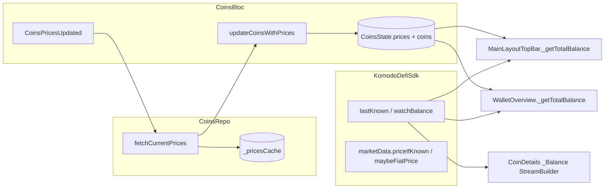

# Pending changes: code review & QA assessment

**Generated:** 2026-03-23  
**Repository:** gleec-wallet-dev (main app + `sdk/` path dependency)  
**Git scope:** Uncommitted working-tree diff only (`git diff` / `git status --short`).

---

## 1. Executive summary

| Area | Result |
|------|--------|
| **SDK (submodule) pending changes** | **None** in the current working tree (`sdk/` clean vs `HEAD`). |
| **Main app pending files** | **5** Dart files (balance/price display, immutability, formatting). |
| **Analyzer (changed files)** | No errors; **4 infos** (2 pre-existing style nits in `coins_bloc.dart`, 2 `implementation_imports` in `wallet_overview.dart`). |
| **Overall risk** | **Medium–low** for crashes; **medium** for **product/consistency** (multiple USD valuation paths in the app). |
| **World-class bar** | Solid immutability and alignment of some UI with `CoinsBloc` CEX prices; gaps in **DRY**, **single source of truth for fiat valuation**, **automated tests**, and **i18n** for new placeholders. |

---

## 2. What “world-class” review entails (external standards)

This review is framed against commonly cited engineering practice:

1. **Google — [What to look for in a code review](https://google.github.io/eng-practices/review/reviewer/looking-for.html)**  
   Emphasis on **design**, **functionality** (including edge cases), **complexity**, **tests**, **naming**, **style**, **consistency**, **documentation**, and reviewing **every line** in context.

2. **Flutter / BLoC ecosystem** (summarized from public guidance, e.g. DCM, Kodus, bloc_test articles)  
   - Guard async work in blocs (e.g. closed emitters).  
   - Prefer selective rebuilds (`BlocSelector`, `context.select`).  
   - Test state transitions and repositories with `bloc_test` / fakes.  
   - Keep widgets thin; avoid duplicating business rules in multiple widgets.

3. **FinTech / wallet UX QA** (industry norm, not a single spec)  
   - **Deterministic** fiat display rules (one price source per surface or explicit labeling).  
   - **Precision**: prefer `Decimal` / fixed-scale formatting for money until the last presentation step.  
   - **Regression tests** for “null price”, “null balance”, “zero balance”, “dust totals”, privacy mode.

---

## 3. Inventory of pending changes (every file)

| File | Role | Nature of change |
|------|------|------------------|
| `lib/bloc/coins_bloc/coins_bloc.dart` | `CoinsBloc` — merges CEX prices into `CoinsState` | Defensive copy of price map; **uppercase** `configSymbol` key for price lookup; `Map.unmodifiable` for updated coin maps; remove unused import; trivial formatting. |
| `lib/bloc/coins_bloc/coins_repo.dart` | Price fetch + activation orchestration | Return **unmodifiable** snapshot of `_pricesCache` from `fetchCurrentPrices()`; formatting only elsewhere in diff. |
| `lib/views/main_layout/widgets/main_layout_top_bar.dart` | Global header balance | Total USD uses `sdk.balances.lastKnown` × `CoinsState.getPriceForAsset`; string interpolation tweak. |
| `lib/views/wallet/wallet_page/wallet_main/wallet_overview.dart` | Wallet overview total | Same total-balance logic as top bar; remove `asset_coin_extension` import. |
| `lib/views/wallet/coin_details/coin_details_info/coin_details_info.dart` | Coin details header balance | `StreamBuilder` on `watchBalance` with `initialData`; placeholder `'--'` when balance unknown. |

**Lines touched (approx.):** +121 / −95 across these five files (`git diff --stat`).

---

## 4. Data-flow and dependency graph (changed code)

**Important:** `CoinsState.getPriceForAsset` already keys with `assetId.symbol.configSymbol.toUpperCase()` (see `coins_state.dart`). The bloc change makes the **merge path** use the **same** keying, which fixes mismatches where the cache was uppercase but lookups were mixed case.

---

## 5. Cross-cutting findings

### 5.1 Strengths

- **Immutability:** Returning `Map<String, CexPrice>.unmodifiable(...)` from `fetchCurrentPrices()` and copying before storing in bloc state reduces accidental mutation of shared caches.
- **Key normalization:** Using `.toUpperCase()` consistently for `configSymbol` when indexing prices aligns `CoinsBloc` merge logic with `CoinsState.getPriceForAsset` and `_pricesCache` writes in `CoinsRepo` (see repo grep: `symbolKey = asset.id.symbol.configSymbol.toUpperCase()`).
- **Live balance on coin details:** `watchBalance` + `initialData: lastKnown` is a good pattern for responsive UI without an empty first frame.
- **Alignment with existing widget:** `CoinFiatBalance` already combines `BlocSelector` (CEX price from `CoinsBloc`) with `watchBalance` — coin details fiat row stays conceptually consistent with that approach.

### 5.2 Price source fragmentation (design / product risk)

The app still has **multiple** ways to compute USD exposure:

| Mechanism | Price source | Balance source | Still used elsewhere? |
|-----------|--------------|----------------|------------------------|
| **New** `_getTotalBalance` (top bar + overview) | `CoinsBloc` / CEX (`getPriceForAsset`) | `sdk.balances.lastKnown` | These two widgets only (in this diff). |
| `Coin.usdBalance(sdk)` | `sdk.marketData.priceIfKnown` | `sdk.balances.lastKnown` | Extension still present (`asset_coin_extension.dart`). |
| `lastKnownUsdBalance(sdk)` | `sdk.marketData.priceIfKnown` | `sdk.balances.lastKnown` | **Yes** — e.g. `expandable_coin_list_item.dart` (other code paths), `portfolio_growth_repository.dart`, `market_maker_bot_form_content.dart`, `grouped_list_view.dart`, `coin_utils.dart`, `coins_manager_helpers.dart`. |

**Impact:** Header/overview totals can **diverge** from sorted lists, portfolio growth math, or MM bot filters that still use SDK-priced `lastKnownUsdBalance`. That may be **intentional** (CEX is “display truth” in wallet chrome) but is **not documented** in code comments or product copy.

**World-class expectation:** Either (a) **one** shared “portfolio valuation” API used everywhere, or (b) explicit naming/UI labels (“CEX estimate”, “SDK price”) and tests asserting allowed drift.

### 5.3 Duplication

`_getTotalBalance` in `main_layout_top_bar.dart` and `wallet_overview.dart` is **byte-for-byte equivalent** (including dust threshold `0.01` behavior). This violates DRY and doubles the cost of fixes and tests.

**Recommendation:** Extract to a small pure function, e.g. `double? computeWalletTotalUsd({required Iterable<Coin> coins, required CoinsState coinsState, required KomodoDefiSdk sdk})` in a `shared/` or `wallet/` util, **unit-tested**.

### 5.4 Floating-point and monetary precision

The new loops use `toDouble()` for balances and prices, then add into `double total`. Financial apps often keep **`Decimal` until formatting** to avoid aggregation error and to match on-chain/UTXO semantics.

**Severity:** Low for **display** totals at 2 decimal places; higher if this value is reused for **limits**, **compliance**, or **trade sizing**.

### 5.5 Internationalization

`coin_details_info.dart` uses a literal `'--'` for unknown balance (previously empty string `''` in some branches). Other widgets use similar placeholders (e.g. `CoinFiatBalance` uses `' (--)'`). For world-class i18n, these should be **locale keys** (including RTL and typographic conventions).

### 5.6 `StreamBuilder` subscription lifecycle

`StreamBuilder` correctly subscribes/unsubscribes per Flutter rules. No manual `StreamSubscription` leak risk in the diff.

### 5.7 QA / testing gaps (bulletproof standard)

No new or updated tests appear in the pending diff. For this change set, **minimum** automated coverage would include:

- **Unit:** `computeWalletTotalUsd` (extracted) with cases: no prices; partial prices; all zero balances; dust `< 0.01`; mixed null `lastKnown`.
- **Bloc:** `_onPricesUpdated` — map equality short-circuit still works when maps are equal but unmodifiable wrappers differ (should be OK with `MapEquality`; worth a test if regressions occurred before).
- **Widget/golden (optional):** coin details balance row with `hideBalances` true/false and null snapshot.

Project note (`AGENTS.md`): tests may be red in CI; still worth **targeted** new tests for this logic if policy allows.

### 5.8 Analyzer notes (non-blocking)

- `lib/views/wallet/wallet_page/wallet_main/wallet_overview.dart`: `implementation_imports` — prefer public API imports from packages.
- `lib/bloc/coins_bloc/coins_bloc.dart`: local identifiers `_fire` / `_checkThreshold` trip `no_leading_underscores_for_local_identifiers` (likely pre-existing; not introduced by this diff’s hunk).

---

## 6. File-by-file notes

### 6.1 `lib/bloc/coins_bloc/coins_bloc.dart`

- **Behavioral:** Price application to `Coin.usdPrice` now keys with uppercase `configSymbol`, matching `CoinsState` and cache writes.
- **Immutability:** `updateCoinsWithPrices` returns `Map<String, Coin>.unmodifiable(map)` — good for equatable/props stability.
- **Observation:** Removed `utils.dart` import — verify no missing extension methods were used elsewhere in the file (analyzer clean suggests OK).

### 6.2 `lib/bloc/coins_bloc/coins_repo.dart`

- **Behavioral:** `fetchCurrentPrices` callers receive a **copy** of `_pricesCache`; internal mutation of `_pricesCache` in the repo no longer exposes the same instance to consumers.
- **Call graph:** `CoinsBloc._onPricesUpdated` → `fetchCurrentPrices` → defensive copy again — **double copy** (acceptable, minor alloc).

### 6.3 `lib/views/main_layout/widgets/main_layout_top_bar.dart`

- **Behavioral change vs `coin.usdBalance(sdk)`:** Switches from SDK `priceIfKnown` to **CEX map** in `CoinsState`. See §5.2.
- **UI:** `'\$$maskedBalanceText'` vs `'\$${maskedBalanceText}'` — equivalent for simple identifiers; fine.

### 6.4 `lib/views/wallet/wallet_page/wallet_main/wallet_overview.dart`

- Same total-balance semantics as top bar; **TODO** in file already asks to migrate to a bloc — this duplication reinforces that TODO.

### 6.5 `lib/views/wallet/coin_details/coin_details_info/coin_details_info.dart`

- **UX:** `'--'` is clearer than empty string for unknown balance but should be localized.
- **Consistency:** `_FiatBalance` → `CoinFiatBalance` path still uses stream + bloc price; aligns with streaming native balance + CEX fiat conversion pattern used elsewhere.

---

## 7. Downstream / “not in diff but affected” map

These areas **consume** the same concepts and should be sanity-checked manually or in a follow-up PR:

- **Still SDK-priced USD:** `lastKnownUsdBalance` / `usdBalance` call sites listed in §5.2.
- **Already CEX + stream in UI:** `lib/shared/widgets/coin_fiat_balance.dart`, parts of `expandable_coin_list_item.dart` (BlocSelector + `watchBalance`).
- **CoinsBloc state:** `grouped_asset_ticker_item.dart`, `legacy_coin_migration_extensions.dart` (`lastKnown24hChange`).

No `CoinsRepo.fetchCurrentPrices` signature change beyond return immutability — all call sites remain valid.

---

## 8. Recommended action items (priority order)

1. **P0 — Decide single valuation story** for wallet totals vs lists/portfolio growth; document in code + optionally release notes.  
2. **P1 — DRY** `_getTotalBalance` + add **unit tests** for edge cases.  
3. **P2 — i18n** for `'--'` / masked patterns where user-visible.  
4. **P3 — Consider `Decimal`** for aggregation if totals feed non-UI logic.  
5. **P3 — Fix** `implementation_imports` in `wallet_overview.dart` when touching that file anyway.

---

## 9. Conclusion

The pending change set is **coherent** for aligning **header/overview totals** and **coin-details balance** with **CEX-backed `CoinsBloc` prices** and **live SDK balances**, and it **hardens** price-map handling with **unmodifiable** snapshots and **consistent key casing**. There are **no SDK submodule edits** in the current working tree.

To reach a **world-class, bulletproof QA** bar, the team should address **dual price sources** across the app, **remove duplicated total logic**, add **targeted automated tests**, and tighten **localization** and **numeric precision** policy for monetary aggregates.

---

## 10. References

- [Google eng-practices: What to look for in a code review](https://google.github.io/eng-practices/review/reviewer/looking-for.html)  
- [Google eng-practices: Standard of code review](https://google.github.io/eng-practices/review/reviewer/standard.html)  
- Flutter BLoC quality/testing discussions (e.g. [DCM — Flutter BLoC best practices](https://dcm.dev/blog/2026/03/11/flutter-bloc-best-practices-youre-probably-missing), [Kodus — Flutter code review guide](https://kodus.io/en/effective-flutter-code-review/))  

---

*This document reflects repository state at generation time; re-run `git status` / `git diff` before relying on it for a later commit.*
