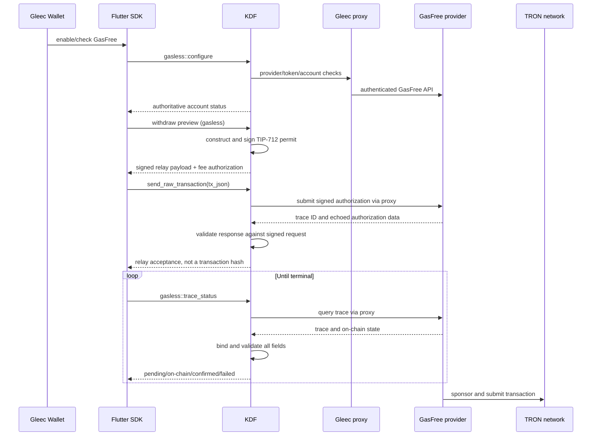

# TRON GasFree staged KDF production hand-over

Status: implementation handoff

Audience: Komodo DeFi Framework maintainers and reviewers

Consumer: Gleec Wallet and `komodo-defi-sdk-flutter`

Last updated: 2026-07-13

## 1. Purpose

This is the complete, self-contained KDF team hand-over for both staged Gleec
Wallet TRON GasFree releases:

1. the **initial limited release**, which is the immediate delivery target; and
2. the later **V2 provider-bound release**, which completes the production
   assurance model.

It is a normative implementation contract, not an audit report. No other local
document is required to determine scope, wire behavior, tests, artifacts, or
acceptance. The words **MUST**, **MUST NOT**, **SHOULD**, and **MAY** have their
usual RFC-style meanings.

The following invariants apply to both release profiles:

- Gleec production configuration MUST pin the service-provider address. In the
  initial profile, the SDK verifies that pin against the signed preview before
  an existing-custody send. V2 additionally enforces it inside KDF before
  status, signing, submission, and trace handling. Automatic discovery is not
  an acceptable production default.
- A GasFree request MUST NOT silently downgrade to a native TRON transfer.
- A missing transaction hash after relay acceptance is a pending relay
  submission, not a failed transaction.

V2 adds a further invariant: reconfiguring an already-active TRON runtime MUST
be authoritative; a synthetic “already active” success is not sufficient.

The protocol source of truth is the
[official GasFree developer documentation](https://docs.gasfree.io/). KDF MUST
follow the official TIP-712 domain, authorization fields, provider API, and
trace-state definitions unless a documented and tested proxy contract explicitly
extends them.

## 2. Staged release strategy

### 2.1 Decision and terminology

The project has deliberately pivoted to a staged rollout. The KDF team's
immediate task is the **initial limited release**, not the full V2 contract.
That release may proceed after the reduced compatibility patch, required tests,
and immutable platform artifacts pass the initial acceptance gate in section
20.1.

The full provider-bound assurance profile remains a separate **V2** delivery
and MUST stay disabled until every V2-scoped **MUST** in sections 3–19 and the
V2 acceptance gate in section 20.2 are complete.

In this document, “V2” names Gleec's hardened product release profile. It does
not change the official GasFree TIP-712 domain version `V1.0.0`, and it is
unrelated to KDF's atomic-swap V2 protocol.

| Release profile | KDF delivery | User-facing scope | Status |
| --- | --- | --- | --- |
| Initial limited release | Existing PR #9 behavior plus the four reason codes, balance-preserving mismatch behavior, timestamp compatibility, tests, and immutable artifacts | Existing GasFree custody visibility, recovery, and guarded sends; Standard TRON remains available; no new GasFree receive address | Immediate implementation and artifact target |
| V2 provider-bound release | Runtime configuration, production provider pinning, signed-request/trace binding, typed lifecycle errors, finality verification, and full native/WASM parity | New GasFree receive onboarding, authoritative readiness, stronger pending/finality UX, and a fully bound send lifecycle | Deferred until every V2 requirement passes |

Shipping the initial profile is an explicit constrained-risk decision. It does
not assert that the legacy provider API is idempotent or that PR #9 binds every
relay response to its signed request. The app and SDK compensate by narrowing
eligibility, disabling new GasFree receives, preserving unresolved submissions,
and refusing retry after any possibly accepted relay request.

### 2.2 Immediate KDF scope: initial limited release

The audited behavior baseline for
[GLEECBTC/kdf-internal PR #9](https://github.com/GLEECBTC/kdf-internal/pull/9)
is `997332e5d6b0c5ca471aa7dc9727a7be96938ae2`. As of 2026-07-13, the PR's
observed remote tip is `bfd7f7ee30deed4e02b87347e19426b52017d580`, which adds
dev-workflow Android Cargo serialization, longer Android job timeouts, and
target-scoped dev-workflow concurrency. Its two new CI commits MUST be rewritten
to satisfy the release commit-history policy before promotion, while preserving
their Conventional Commit subjects and code changes; the rewritten tip will
therefore have a new SHA. The reduced patch
`a341a3e714bb2719ddb55c527bf37741c83de99e` was authored from the audited
behavior baseline and MUST be replayed onto that rewritten CI tip.

The resulting combined commit, plus any required test-only or build-only
correction, becomes the initial release candidate. All artifacts MUST be built
from and report that final full SHA.

The KDF team MUST deliver the following initial behavior:

1. `reason_code` is an optional `gasless::account_status` response field: it is
   omitted when the account is ready and MUST contain the matching value when
   one of these four degraded conditions occurs:
   `provider_temporarily_unavailable`, `token_unsupported`,
   `token_decimals_mismatch`, or `custody_address_mismatch`.
2. Provider-unavailable, unsupported-token, and decimal-mismatch paths return
   the locally read GasFree custody total with `provider_available: false`;
   spendable, maximum-withdrawable, activation, frozen, active, and fee fields
   serialize as `null`.
3. A custody-address mismatch preserves the locally derived custody balance for
   recovery with `provider_available: false`; every provider-derived optional
   field serializes as `null`, and KDF exposes no spendability or receive
   readiness.
4. Provider timestamps accept RFC3339, epoch seconds, or epoch milliseconds.
   Projected `confirmed_at` is normalized to epoch seconds on the KDF wire
   response. Submit/trace created, updated, and expiry integers retain their
   supplied units; consumers MUST detect and normalize those units explicitly.
5. Existing strict PR #9 `tx_json` remains wire-compatible. The reduced patch
   MUST NOT add request-envelope fields to the signed relay payload.
6. Standard TRX and Standard TRC-20 behavior remains unchanged and available
   whenever GasFree is unavailable.
7. Focused native tests cover every reason, balance-only response, timestamp
   shape, and regression boundary. Shared pure parsing logic SHOULD use
   `cross_test!` unless a target-specific reason is recorded.
8. Immutable artifacts and independent SHA-256 checksums are published for
   every declared platform, including Android armv7 and Android arm64.

For this staged plan, the 200-touched-line constraint applies to the reduced
Rust behavior patch: `a341a3e…` is exactly 170 additions plus 30 deletions
against `997332e5…`. Existing CI-only changes and mandatory test-only corrections
are separately reviewed exceptions to that runtime-patch budget. They MUST NOT
broaden initial runtime behavior. Consequently, the final release-candidate
diff and SHA will be larger and different. If repository governance instead
applies 200 lines to the entire PR, the patch MUST first be reduced because that
interpretation is incompatible with the required CI and regression evidence.

The following are explicitly **not required for the initial KDF release** and
remain V2 work:

- `gasless::configure` and authoritative reconfiguration of an already-active
  TRON runtime;
- provider-pin enforcement inside account status;
- KDF-issued request envelopes, idempotency keys, or signed-payload
  fingerprints;
- field-by-field submit-response and trace-response binding;
- the V2 typed relay lifecycle error family;
- new-receive capability attestation; and
- any change to PR #9's strict signed `tx_json` shape.

Against the initial KDF contract, a missing `gasless::configure` method is the
expected compatibility signal. Any other configuration error remains fail-
closed in the SDK.

### 2.3 Initial-release assurance envelope

The initial app and SDK profile is intentionally narrow:

- GasFree defaults to disabled; production must explicitly enable the limited
  profile after release-owner risk acceptance, and no remote receive control
  may override the legacy contract's new-receive prohibition;
- only the exact mainnet `USDT-TRC20` or Nile `TESTUSDT-TRC20` identity,
  canonical contract, matching network, configured provider, primary software-
  wallet derivation, and canonical custody address is eligible;
- the exact enrolled identities are mainnet `USDT-TRC20` on `TRX`, contract
  `TR7NHqjeKQxGTCi8q8ZY4pL8otSzgjLj6t`, and Nile `TESTUSDT-TRC20` on `TRXT`,
  contract `TXYZopYRdj2D9XRtbG411XZZ3kM5VkAeBf`; both use 6 decimals and the
  primary path `m/44'/195'/0'/0/0`;
- Trezor, custom tokens, secondary derivations, wrong-network assets, and
  provider-rejected tokens always use Standard TRON;
- PR #9 account status is provisional because it does not echo the selected
  provider. It may preserve custody access but cannot authorize a new receive
  surface;
- a signed preview must contain the configured provider before an existing
  custody balance can be submitted;
- the SDK-generated request ID and fingerprint are wallet-local recovery data
  and are never injected into the legacy signed relay payload;
- a transport-ambiguous submit, malformed response, trace mismatch, or legacy
  terminal failure remains non-retryable `submittedUnknown`;
- the initial KDF profile does not provide V2 recursive redaction or complete
  raw-body suppression. Production MUST use the Gleec proxy's stable sanitized
  error contract, direct provider/HMAC mode remains development-only, raw relay
  diagnostics remain off, and support bundles MUST exclude raw KDF/provider
  errors;
- a legacy trace becomes confirmed only after on-chain history verifies the
  transaction hash, token, custody source, recipient, authorized amount, and
  `finalFee <= signedMaxFee`; and
- existing custody balances, pending activity, Standard addresses, and recovery
  remain visible when availability becomes stale, disabled, or unsupported.

The initial profile therefore supports recovery and guarded sending of funds
already held in GasFree custody. It MUST NOT expose, copy, or encode a new
GasFree receive address. New GasFree receive onboarding is a V2 capability.

### 2.4 GUI value enabled by the staged system contract

KDF does not own Flutter layout or copy. Its structured responses, together
with the initial SDK/app/proxy mitigations and later V2 KDF guarantees,
determine whether the GUI can be accurate and financially safe.

- **Truthful availability:** users see neutral, unsupported, recovery, or
  security states instead of a false green GasFree promise.
- **Preserved access:** provider or token problems do not make an existing
  custody balance disappear.
- **Safer sending:** the initial SDK treats every ambiguous relay outcome as
  processing and suppresses duplicate sends; V2 KDF adds authoritative
  rejected-versus-accepted classification.
- **Clear money presentation:** custody total, spendable amount, fee maximum,
  recipient amount, and final fee remain distinct.
- **Predictable recovery:** Standard TRON remains usable and unsupported custody
  deposits retain an official recovery path.
- **V2 onboarding:** once KDF provides provider-bound readiness, the GUI can
  safely reveal GasFree receive QR/copy actions and upgrade already-active
  runtimes without restart.

| Interface or system behavior | Initial-release GUI value | Additional V2 GUI value |
| --- | --- | --- |
| Four stable account-status reasons | Distinct temporary, unsupported, decimal-mismatch, and security messaging | Reasons become part of an authoritative provider-bound capability state |
| Deterministic token, decimal, or custody mismatch | Custody funds stay visible with recovery actions, while in-app GasFree send/receive controls remain disabled | Provenance is combined with authoritative spendable and frozen amounts |
| Temporary provider unavailability | Custody balance and recovery remain visible with neutral messaging; receive and stale spend limits stay hidden while recheck or fresh preview remains available | Provider-bound status distinguishes a safe retry from a security mismatch |
| RFC3339/seconds/milliseconds compatibility | Normalized `confirmed_at` renders consistently; created, updated, and expiry values are accepted without assuming they were normalized | Bound trace finality adds trustworthy block and confirmation metadata |
| Strict Standard/GasFree rail separation | Unsupported users remain on familiar Standard TRON instead of silently entering custody | KDF attests the exact rail and runtime configuration before signing |
| Legacy signed preview exposes the service provider; SDK verifies the configured pin | Existing custody sends show provider, fee maximum, and expiry before approval | KDF verifies the provider pin before status, preview, submit, and every trace response |
| Legacy relay result plus SDK recovery policy | GUI shows “Still processing,” keeps durable activity, and hides “Try again” | Bound request/trace data allows stronger reconciliation and terminal-state classification |
| Runtime reconfiguration | Not available; new receives stay hidden | Already-active TRON assets can become authoritatively GasFree-ready without restart |
| Production error sanitation | Release enablement requires operational proof that the Gleec proxy emits only stable codes/correlation IDs and withholds raw provider content from GUI and support bundles | KDF additionally enforces recursive redaction and raw-body suppression at the protocol boundary |
| Immutable native/WASM artifacts | The same limited behavior reaches supported devices, including Android | Every platform exposes the complete provider-bound V2 contract with parity evidence |

The initial `reason_code` values map to the following safe GUI contract:

| `reason_code` | Initial KDF response | Required GUI interpretation |
| --- | --- | --- |
| Omitted | `provider_available: true` with provider-derived fields | Existing-custody send may proceed only after signed-preview provider verification; GasFree receive remains hidden |
| `provider_temporarily_unavailable` | Custody total retained; provider-derived fields `null` | Neutral temporary-unavailability state, retained balance/recovery, no receive, and no displayed spend limit; allow recheck or a fresh authoritative preview attempt |
| `token_unsupported` | Custody total retained; no spendability | Use Standard TRON for normal wallet actions and offer official custody recovery; no GasFree send or receive |
| `token_decimals_mismatch` | Custody total retained; no spendability | Security/recovery state with support guidance; no GasFree send or receive |
| `custody_address_mismatch` | Locally derived custody balance retained; no spendability | Security/recovery state that disables in-app GasFree send/receive and exposes the official recovery route |

### 2.5 V2 provider-bound delivery

The V2-scoped requirements in sections 3–19 specify the deferred KDF
implementation; requirements marked **Initial release** or **Both profiles**
apply as stated. V2 is required before the app may enable new GasFree receives
or claim a fully provider-bound relay lifecycle. Android build fixes alone do
not satisfy V2 because signing and relay submission occur inside KDF; runtime
safety, response binding, typed errors, and finality verification must also be
implemented.

### 2.6 Local delivery references

The implementation is deliberately split so the initial pull request stays
reviewable while the complete V2 target remains available to the KDF team:

| Component | Local branch | Commit | Purpose |
| --- | --- | --- | --- |
| KDF PR #9 observed CI tip | `feat/tron-gasfree-gui-tweaks` remote PR tip | `bfd7f7ee30deed4e02b87347e19426b52017d580` | Audited behavior plus dev-workflow Android serialization, longer Android timeouts, and target-scoped dev concurrency; rewrite to satisfy release commit-history policy before promotion |
| KDF compatibility patch | `feat/tron-gasfree-gui-tweaks` | `a341a3e714bb2719ddb55c527bf37741c83de99e` | Additive account-status reasons and provider timestamp compatibility only |
| Complete KDF contract | `add/gas-free-tron-hardening` | `049012bc3540f3307e67c1afe537c8208f6498b5` | Full provider pinning, runtime configuration, relay binding, typed errors, and validation |
| Flutter SDK | `add/tron-gas-free` and `add/gas-free-tron-hardening` | `fa56cf611cc7f1b3556bece704e4ba316735b2d0` | Hardened SDK with bound-relay and conservative initial-profile modes |
| Gleec Wallet implementation | `add/gas-free-tron` | `03ab61c9f748fb73f49dae72f76d46855c8f3553` | Last non-document snapshot: capability gates, custody UX, recovery, integrations, and rollout controls |

The complete KDF tip consists of these reviewable commits, oldest first:

1. `4b2bfa8dc966c24d24fdc2fc3f8414068cce0a79` — provider invariants;
2. `32804840ab73e281016cb322c875ed76d1954d1a` — runtime reconfiguration;
3. `223c31ab6a3dc8975d616942bfbc2f8fdb3306db` — relay lifecycle binding;
4. `049012bc3540f3307e67c1afe537c8208f6498b5` — integration coverage.

That V2 tip is a reference snapshot based on `997332e5…`, not a directly
promotable descendant of the final initial release. Before V2 promotion, its
commits MUST be rebased or cherry-picked and reconciled onto the final initial-
release SHA, retaining the four reason codes, timestamp compatibility, approved
Android CI fixes, and all initial regression coverage.

The SDK hardening tip consists of these reviewable commits, oldest first:

1. `49c5a8395fb9dd25be21d29f638a4114c1641113` — hardened public transfer contracts;
2. `996170711b913bb7785c1197456390ce017f4172` — wallet-scoped capability enforcement;
3. `68bc1a09c9aa38eb650fb889f9da3404660f5a6c` — durable unresolved-relay recovery;
4. `80ebc370093e85d539e928a6b5f3614327213d4d` — custody balance and history reconciliation;
5. `0bfb44f49feb99d5eaf78609a879870dff8dd41c` — spend-limit UI clarity;
6. `fa56cf611cc7f1b3556bece704e4ba316735b2d0` — SDK 1.0 migration metadata.

The Gleec Wallet implementation snapshot consists of these reviewable commits,
oldest first:

1. `0872843db0978a54ad8608cd0bc88f3e7ef07010` — hardened SDK integration and artifact reference;
2. `9b2e5c7ddf1f55dbd3e03d23abb9aa35f4a2bd3a` — custody and relay-state UX;
3. `64fd06de95a2dc23e6b19e85a6e2e3b8c28b8b0c` — wallet integrations and sensitive-action revalidation;
4. `176c6d643e076a211834b1bf38a02cd521c3f6f7` — production proxy controls;
5. `03ab61c9f748fb73f49dae72f76d46855c8f3553` — release configuration gates.

The documentation commit containing this specification is the local main-app
branch tip. It cannot embed its own commit identifier without changing that
identifier; the five immutable implementation commits above are the handoff
reference for code and configuration review.

The compatibility branch adds only
`a341a3e714bb2719ddb55c527bf37741c83de99e`. Its measured delta from PR #9
audited behavior baseline `997332e5d6b0c5ca471aa7dc9727a7be96938ae2`
is exactly 170 additions and 30 deletions (200 touched lines).

These branches and commits are provenance and implementation-acceleration aids;
the normative requirements in this document do not depend on access to them.
They are not published artifacts and MUST NOT be placed in an SDK build manifest
until their commits and immutable binaries are available to every build
environment.

### 2.7 Visual-design gate status

This is wallet-team context, not a KDF acceptance criterion. KDF's GUI-facing
responsibility ends at stable, typed, semantically correct response data.

- **Basis:** the Gleec UI-Pro accessibility, touch, responsive, forms/error
  recovery, navigation, and financial-data checklists were applied to the
  Flutter flow.
- **Status:** exception. No canonical Purple Vault design pack or repository
  design-language source was available in this checkout.
- **Implemented under the exception:** behavioral state clarity, existing-theme
  consistency, semantic labels and announcements, minimum touch targets,
  scroll/wrap behavior, light/dark contrast review, and 200% text support.
- **Wallet-team follow-up:** obtain the canonical design source and complete
  identical-viewport visual comparisons before describing the feature as
  visually pristine.

## 3. Scope

Unless a requirement is explicitly labeled **Initial release** or **Both
profiles**, sections 3–19 define the V2 provider-bound profile. Sections 5 and
15 explicitly preserve shared protocol and compatibility invariants. In
sections 3–19, **Release blocker** means a blocker for V2 enablement unless the
heading says **Initial release blocker**.

### 3.1 In scope

- TRON mainnet and Nile network identification.
- TRC-20 GasFree provider configuration.
- Canonical software-wallet eligibility.
- Runtime GasFree configuration for already-active coins.
- Custody account status and balance provenance.
- GasFree withdraw preview and TIP-712 signing.
- Relay submission through `send_raw_transaction` or an equivalent typed RPC.
- Relay acceptance, trace polling, finality, and response verification.
- Stable typed RPC errors.
- Secret redaction and safe diagnostics.
- Native/WASM parity and immutable release artifacts.

### 3.2 Out of scope

- Flutter UI layout, copy, accessibility, and localization.
- SDK encrypted storage and restart reconciliation.
- Application remote receive kill switch.
- Production proxy deployment, peer mesh, rate limiting, CORS, and operations.
- DEX settlement from GasFree custody.
- Multi-address GasFree custody in either Gleec release profile.

The SDK owns durable pending-transfer persistence. KDF owns the correctness and
security of every value the SDK persists.

## 4. Protocol and trust model

### 4.1 Initial limited flow

The initial release uses the legacy PR #9 contract. It does not call
`gasless::configure`, and it does not add local SDK recovery fields to KDF's
strict signed `tx_json`.

```mermaid
sequenceDiagram
    participant App as Gleec Wallet
    participant SDK as Flutter SDK
    participant KDF
    participant Provider as GasFree provider
    participant Tron as TRON network

    App->>SDK: inspect existing custody state
    SDK->>KDF: gasless::account_status
    KDF->>Provider: read account/provider status
    KDF->>Tron: read canonical custody token balance
    KDF-->>SDK: full or balance-only provisional status
    Note over App,SDK: New GasFree receive remains hidden
    App->>SDK: send existing custody funds
    SDK->>KDF: legacy gasless withdraw preview
    KDF-->>SDK: strict signed tx_json + fee authorization
    SDK->>SDK: verify provider pin; persist local request ID/fingerprint
    SDK->>KDF: send_raw_transaction(strict tx_json)
    KDF->>Provider: submit signed authorization
    Provider-->>KDF: legacy acceptance or transport outcome
    KDF-->>SDK: trace/legacy result
    SDK->>SDK: persist trace immediately when present
    loop Until exact reconciliation
        SDK->>KDF: legacy trace status
        SDK->>Tron: verify raw on-chain token event
    end
    SDK-->>App: processing, confirmed, or non-retryable unknown
```

The local request ID and fingerprint improve wallet-scoped recovery but are not
provider idempotency keys. KDF does not provide field-bound relay assurance in
this profile. That residual risk is why ambiguous outcomes remain locked and
why confirmation requires exact on-chain reconciliation.

### 4.2 V2 provider-bound flow



Trust assumptions:

- In the initial profile, the SDK and app MUST treat unbound provider data as
  provisional and apply the assurance envelope in section 2.3.
- In V2, the SDK and app MUST NOT trust provider data that KDF has not
  validated and bound to the signed request.
- The provider may be unavailable, stale, compromised, or return a response for
  the wrong authorization.
- A transport failure during the submit POST may occur before or after provider
  acceptance. It is therefore an unknown financial outcome unless KDF has
  definitive evidence of rejection.
- `requestId` is documented by GasFree for issue investigation; the official
  API does not promise idempotency or request-ID lookup. KDF MUST NOT treat it as
  an idempotency guarantee.

## 5. Network constants and signed authorization — Both profiles

KDF MUST use the official GasFree constants:

| Network | Chain ID | Verifying contract |
| --- | ---: | --- |
| TRON mainnet | `728126428` | `TFFAMQLZybALaLb4uxHA9RBE7pxhUAjF3U` |
| Nile | `3448148188` | `THQGuFzL87ZqhxkgqYEryRAd7gqFqL5rdc` |

The TIP-712 domain MUST be:

```text
name: GasFreeController
version: V1.0.0
chainId: network-specific value above
verifyingContract: network-specific value above
```

The signed `PermitTransfer` message MUST bind exactly:

```text
token
serviceProvider
user
receiver
value
maxFee
deadline
version
nonce
```

Requirements:

- `version` MUST equal `1` until a separately reviewed protocol upgrade exists.
- `value`, `maxFee`, `deadline`, `version`, and `nonce` MUST be parsed without
  floating-point conversion.
- Provider amounts MUST be interpreted in token base units and converted using
  the activated token’s authoritative decimal count.
- Signature generation and recovery MUST use the exact signed message above.
- **V2:** Chain ID, verifying contract, token, provider, signer, receiver, amount,
  maximum fee, deadline, version, and nonce MUST be revalidated immediately
  before submission.

## 6. Capability and wallet eligibility

### KDF-GF-001 — Canonical wallet identity — Release blocker

The Gleec single-custody GasFree profile MUST be available only for the
canonical primary software-wallet address:

- HD wallet: external address `m/44'/195'/0'/0/0` only.
- Iguana wallet: its single primary address.
- Trezor, WalletConnect, MetaMask, secondary HD derivations, change addresses,
  or any address not owned by the active wallet MUST be rejected.

KDF MUST derive the GasFree custody address locally from the canonical EOA and
network. A provider-reported custody address MUST match this local derivation.

For the initial profile, the SDK and app MUST restrict GasFree custody to that
single canonical address and treat secondary derivations as Standard TRON. V2
KDF MUST enforce the same restriction authoritatively and MUST NOT expose
additional GasFree custody accounts for secondary derivations.

### KDF-GF-002 — Token and network capability — Release blocker

Eligibility MUST be based on all of the following, not on ticker alone:

- active chain is TRON;
- active asset is a TRC-20 token of that platform;
- token contract belongs to the active network;
- provider reports that exact contract as supported;
- provider decimal count matches KDF’s activated token decimals;
- provider pin is resolved and matches;
- wallet identity satisfies KDF-GF-001;
- token has a live runtime GasFree configuration.

Every unverified case MUST fail closed. KDF MUST NOT infer GasFree support from
a `gasfree_address` field or from a token name.

## 7. Provider configuration

### KDF-GF-003 — Strict configuration — Release blocker

KDF MUST support a provider configuration equivalent to:

```json
{
  "base_url": "https://quicknode.gleec.com/gasfree/tron",
  "service": "komodo_proxy",
  "service_provider": "T...",
  "allow_service_provider_discovery": false,
  "request_timeout_ms": 15000,
  "status_poll_interval_ms": 3000,
  "unsafe_allow_insecure_http": false
}
```

Production invariants:

- `service_provider` is mandatory and MUST be a valid TRON address.
- `allow_service_provider_discovery` defaults to `false`.
- The provider returned by `/api/v1/config/provider/all` MUST contain the pinned
  address. A mismatch MUST fail before signing.
- `service` MUST be `komodo_proxy` in production.
- Direct HMAC mode MAY exist for development only and MUST require an explicit
  `unsafe_allow_direct_hmac: true` opt-in.
- Direct HMAC credentials MUST NOT be accepted when empty.
- Production URLs MUST use HTTPS.
- URL credentials, query parameters, fragments, backslashes, duplicate path
  separators, traversal-like segments, and malformed paths MUST be rejected.
- Plain HTTP MUST require an explicit development-only opt-in.
- Request timeout MUST be bounded to `1,000..60,000 ms`.
- Status polling interval MUST be bounded to `500..60,000 ms`.
- Configuration validation MUST use runtime errors, not `assert!` or
  release-disabled assertions.

Direct mode uses a host-only URL and KDF appends the network path. Proxy mode
preserves the configured proxy mount and network path. KDF MUST not silently
rewrite a production proxy URL to another network.

### KDF-GF-004 — Provider limits — V2 release blocker

KDF MUST fetch and validate the pinned provider’s:

- `maxPendingTransfer`;
- `minDeadlineDuration`;
- `defaultDeadlineDuration`;
- `maxDeadlineDuration`.

The requested deadline duration MUST fall within provider bounds. An omitted
duration uses the provider default. The absolute signed deadline MUST be
revalidated immediately before submission.

## 8. Runtime configuration RPC

### Activation-time configuration

Fresh TRON activation MUST accept the same provider contract under
`tron_gasless_provider`, and each token request MUST opt in explicitly:

```json
{
  "ticker": "TRX",
  "nodes": [{ "url": "https://..." }],
  "tron_gasless_provider": {
    "base_url": "https://quicknode.gleec.com/gasfree/tron",
    "service": "komodo_proxy",
    "service_provider": "T...",
    "allow_service_provider_discovery": false
  },
  "erc20_tokens_requests": [
    {
      "ticker": "USDT-TRC20",
      "gasless": {
        "enabled": true,
        "transfer_max_fee": "20"
      }
    }
  ]
}
```

The fresh activation path and `gasless::configure` MUST share the same
validation helpers and capability semantics. A token MUST NOT become GasFree
ready merely because its activation request contained `gasless.enabled=true`.
Provider enrollment, decimals, wallet identity, custody identity, and account
status must all pass first. Passive re-enable MUST either apply the requested
configuration authoritatively or return a typed mismatch directing the caller
to `gasless::configure`; it MUST NOT silently retain a provider-less runtime.

### KDF-GF-005 — `gasless::configure` — Release blocker

KDF MUST expose an authoritative one-shot RPC for an already-active TRON
platform and token set.

Request:

```json
{
  "mmrpc": "2.0",
  "method": "gasless::configure",
  "params": {
    "platform_coin": "TRX",
    "provider": {
      "base_url": "https://quicknode.gleec.com/gasfree/tron",
      "service": "komodo_proxy",
      "service_provider": "T...",
      "allow_service_provider_discovery": false,
      "request_timeout_ms": 15000,
      "status_poll_interval_ms": 3000
    },
    "tokens": [
      {
        "coin": "USDT-TRC20",
        "transfer_max_fee": "20"
      }
    ]
  }
}
```

Response:

```json
{
  "platform_coin": "TRX",
  "service_provider": "T...",
  "tokens": [
    {
      "coin": "USDT-TRC20",
      "account_status": {
        "gasfree_address": "T...",
        "active": true,
        "on_chain_balance": "100",
        "frozen_balance": "0",
        "spendable_balance": "100",
        "transfer_fee": "1",
        "activation_fee": null,
        "max_withdrawable": "99",
        "provider_available": true
      }
    }
  ]
}
```

Required behavior:

- Reject an empty token list and duplicate tickers.
- Reject inactive, non-TRON, wrong-platform, or non-TRC-20 assets.
- Verify each token’s contract, enrollment, decimals, provider status, and
  canonical account before mutating any live coin state.
- Validate the full request before publishing any partial capability.
- Publish token configuration first and the provider runtime last, or use an
  equivalent atomic update that prevents partial readiness.
- Return success only after an authoritative account-status check succeeds for
  every requested token.
- If the active runtime already uses another provider pin, fail explicitly.
  Provider rotation requires resolving outstanding transfers, deactivating the
  platform, and reactivating with the new pin.
- Use `#[serde(deny_unknown_fields)]` on request types.

Required typed errors include:

```text
CoinNotFound
InvalidPlatform
InvalidToken
DuplicateToken
EmptyTokenList
TokenNotSupported
TokenDecimalsMismatch
AccountStatusUnavailable
InvalidConfiguration
ProviderError
Internal
```

Errors MUST implement `SerializeErrorType` and `HttpStatusCode` with
appropriate 4xx, 502/503, and 500 mappings.

## 9. Custody account status RPC

### KDF-GF-006 — `gasless::account_status` — Release blocker

Request:

```json
{
  "mmrpc": "2.0",
  "method": "gasless::account_status",
  "params": { "coin": "USDT-TRC20" }
}
```

The response MUST contain:

| Field | Meaning |
| --- | --- |
| `gasfree_address` | Locally derived canonical custody address |
| `active` | Provider activation status, or `null` when unavailable |
| `on_chain_balance` | TRC-20 balance at the custody address; always present |
| `frozen_balance` | Provider-reported in-flight amount, or `null` |
| `spendable_balance` | Custody total minus frozen, or `null` |
| `transfer_fee` | Token-denominated provider transfer fee, or `null` |
| `activation_fee` | One-time token fee when applicable, otherwise `null` |
| `max_withdrawable` | Spendable minus fees, clamped to zero, or `null` |
| `provider_available` | Whether provider-derived fields are authoritative |
| `reason_code` | Stable degraded/security reason, omitted when ready |

Allowed `reason_code` values:

```text
provider_temporarily_unavailable
provider_identity_mismatch
provider_authentication_failed
provider_invalid_response
token_unsupported
token_decimals_mismatch
custody_address_mismatch
```

Requirements:

- `on_chain_balance` MUST be read from the custody address, never substituted
  from the EOA.
- KDF MUST combine the on-chain balance with provider `frozen` state before
  calculating spendability.
- When provider status cannot be trusted, KDF SHOULD return an on-chain-only
  degraded snapshot: provider-derived fields are `null`,
  `provider_available=false`, and a stable reason is present.
- Identity, token, decimal, or custody mismatch MUST never return spendability.
- Authentication failure may degrade for read-only balance visibility, but
  preview/submission MUST still fail.
- Unknown provider states or malformed amounts MUST not be accepted.

## 10. Withdraw preview and signed relay payload

### KDF-GF-007 — Explicit rail selection — Release blocker

A GasFree preview request MUST use an explicit rail:

```json
{
  "coin": "USDT-TRC20",
  "from": { "derivation_path": "m/44'/195'/0'/0/0" },
  "to": "T...",
  "amount": "10",
  "max": false,
  "fee_method": "gasless",
  "gasless": {
    "max_fee": "2",
    "deadline_seconds": 300,
    "fallback_to_native": false
  }
}
```

Requirements:

- `fallback_to_native` MUST default to `false`.
- Gleec production requests always set it to `false`.
- When false, KDF MUST return a typed error instead of building a native TRON
  transaction for any GasFree failure.
- GasFree options used with the native rail or a non-TRON asset MUST be rejected.
- Preview MUST re-fetch account info, recommended nonce, frozen funds, token
  enrollment, fees, `allowSubmit`, and provider limits.
- The selected source MUST be the canonical EOA from KDF-GF-001.
- `max=true` MUST calculate the maximum from authoritative custody spendable
  funds after frozen value, transfer fee, and activation fee.
- Zero, below-fee, fully frozen, partially frozen, and exact-fee boundaries
  MUST be distinguished.
- Fee cap is the smaller of the request cap and runtime token cap. The quoted
  fee MUST not exceed it.
- The permit MUST be signed locally only after all preflight checks pass.

The preview fee variant MUST be distinct from native TRON fees and include:

```json
{
  "type": "TronGasless",
  "coin": "USDT-TRC20",
  "fee_method": "gasless",
  "provider_name": "gasfree",
  "provider_address": "T...",
  "gasfree_address": "T...",
  "transfer_fee": "1",
  "activation_fee": null,
  "total_token_fee": "1",
  "signed_max_fee": "2",
  "authorization_deadline": "1780000000",
  "request_id": "uuid-v4",
  "authorization_fingerprint": "sha256-hex",
  "trace_id": null
}
```

The opaque `tx_json` relay payload MUST contain enough information for KDF to
revalidate the authorization at submission, including:

```text
relay type and wire version
UUID-v4 request ID
SHA-256 signature fingerprint
chain ID
coin
source derivation selector, when HD
source EOA
locally derived custody address
verifying contract
complete signed authorization
creation time
```

Secret-bearing relay payloads MUST use strict deserialization and redacted
debug/string output.

## 11. Relay submission

### KDF-GF-008 — Pre-submit revalidation — Release blocker

Before any provider submit POST, KDF MUST:

1. Strictly decode the relay payload and reject unknown fields.
2. Verify relay type/wire version.
3. Confirm the coin is the configured TRC-20 token.
4. Confirm chain ID and verifying contract.
5. Confirm token and pinned provider.
6. Confirm source EOA belongs to the active wallet.
7. Confirm HD source is exactly the canonical primary derivation.
8. Recompute and compare the custody address.
9. Recover and verify the TIP-712 signature.
10. Compare the raw signature fingerprint.
11. Confirm receiver, amount, maximum fee, deadline, version, and nonce.
12. Confirm the signed maximum fee does not exceed the current runtime cap.
13. Reject expired or provider-out-of-range deadlines.
14. Re-fetch account info and verify EOA, custody address, nonce, token,
    decimals, fees, frozen balance, and `allowSubmit`.

KDF MUST serialize preflight and submit under a per-canonical-EOA lock so two
local calls cannot both observe `allowSubmit=true` and submit concurrently.

### KDF-GF-009 — Submission response binding — Release blocker

KDF MUST validate the provider submit response before returning relay
acceptance. It MUST compare:

```text
trace ID format
request ID, when echoed
account EOA
locally derived custody address
provider address
receiver/target address
token contract
recipient amount
maximum fee
version
nonce
expiry/deadline
signature, when echoed
estimated activation + transfer fee <= signed maximum
```

If the response contains a valid trace ID but another field mismatches, KDF
MUST return a typed security error with `relay_accepted=true`, the safe request
ID, trace ID, and mismatched field. The client must then reconcile the trace and
must not resubmit.

### KDF-GF-010 — Successful submission contract — Release blocker

A successful relay submission MUST return a relay acceptance, not a fake
on-chain transaction hash:

```json
{
  "relay_type": "tron_gasfree",
  "request_id": "uuid-v4",
  "trace_id": "provider-trace-uuid",
  "state": "WAITING",
  "expected_authorization": {
    "request_id": "uuid-v4",
    "account": "T...",
    "custody_address": "T...",
    "provider": "T...",
    "receiver": "T...",
    "token": "T...",
    "amount": "10000000",
    "max_fee": "2000000",
    "deadline": "1780000000",
    "version": "1",
    "nonce": "9",
    "signature_fingerprint": "sha256-hex"
  }
}
```

`request_id`, `trace_id`, and the expected authorization context MUST be
available to the SDK immediately. `tx_hash` remains absent until the provider
reports an on-chain transaction.

## 12. Typed submission errors

### KDF-GF-011 — Stable error envelope — Release blocker

GasFree structured-submission errors MUST NOT be flattened into display text.
The wire shape MUST be equivalent to:

```json
{
  "error": "GasFree relay submission failed",
  "error_type": "GaslessRelaySubmission",
  "error_data": {
    "code": "authorization_expired",
    "stage": "submission",
    "retryable": true,
    "terminal": true,
    "relay_accepted": false
  }
}
```

Required stable codes:

| Code | Meaning | `relay_accepted` | Safe action |
| --- | --- | --- | --- |
| `invalid_payload` | Invalid relay wire payload | `false` | Fix request; do not replay unchanged |
| `wrong_coin_type` | Not a configured TRC-20 | `false` | Use Standard rail |
| `runtime_missing` | GasFree runtime not configured | `false` | Reconfigure |
| `chain_id_mismatch` | Wrong network | `false` | Security/configuration failure |
| `verifying_contract_mismatch` | Wrong TIP-712 domain | `false` | Security failure |
| `service_provider_mismatch` | Provider differs from pin | `false` | Security failure |
| `token_mismatch` | Token differs from active contract | `false` | Security failure |
| `invalid_address` | Malformed address | `false` | Fix request |
| `custody_address_mismatch` | Wrong CREATE2 account | `false` | Security failure |
| `signature_mismatch` | Signature/fingerprint invalid | `false` | Security failure |
| `wallet_ownership_mismatch` | Signer not active wallet | `false` | Security failure |
| `authorization_expired` | Deadline elapsed | `false` | Generate a new preview/authorization |
| `pending_transfer` | Provider allows no new submission | `false` | Reconcile existing transfer |
| `provider_rejected` | Definite provider rejection | `false` | Correct request; classify by stable reason |
| `authentication_rejected` | Proxy/provider auth failed | `false` | Configuration failure |
| `rate_limited` | Definite 429 rejection | `false` | Retry later with a new status check |
| `provider_unavailable` | Failure proved before POST | `false` | Retry later |
| `provider_timeout` | Timeout proved before POST | `false` | Retry later |
| `submission_outcome_unknown` | Submit POST outcome ambiguous | omitted | Block resubmission; reconcile/support |
| `provider_response_mismatch` | Invalid provider/preflight response proven before submit POST | `false` | Security failure |
| `accepted_response_mismatch` | Trace ID returned but response mismatched | `true` | Persist trace and reconcile; never replay |
| `internal` | KDF cannot prove financial outcome | omitted unless proven | Block replay until resolved |

Semantics:

- `retryable=true` means a caller may retry the operation described by the
  error after its condition changes. It never permits replaying an expired or
  potentially accepted signed payload.
- A timeout, disconnect, malformed body, upstream 5xx, or proxy failure during
  the submit POST MUST produce `submission_outcome_unknown` unless KDF has
  definitive pre-acceptance rejection evidence.
- A malformed or mismatched submit response without a usable trace ID is also
  `submission_outcome_unknown`; KDF MUST NOT reuse the pre-submit
  `provider_response_mismatch` code for an ambiguous POST outcome.
- `relay_accepted` MUST be omitted when unknown. It MUST NOT default to false.
- Raw provider bodies and provider exception strings MUST NOT appear in the
  envelope.

Provider rejection reasons SHOULD be normalized from the official error set:

```text
provider_address_not_match
deadline_exceeded
invalid_signature
unsupported_token
too_many_pending_transfers
version_not_supported
nonce_not_match
max_fee_exceeded
insufficient_balance
```

## 13. Trace status and finality

### KDF-GF-012 — `gasless::trace_status` — Release blocker

Request:

```json
{
  "mmrpc": "2.0",
  "method": "gasless::trace_status",
  "params": {
    "coin": "USDT-TRC20",
    "trace_id": "provider-trace-uuid",
    "expected_authorization": {
      "request_id": "uuid-v4",
      "account": "T...",
      "custody_address": "T...",
      "provider": "T...",
      "receiver": "T...",
      "token": "T...",
      "amount": "10000000",
      "max_fee": "2000000",
      "deadline": "1780000000",
      "version": "1",
      "nonce": "9",
      "signature_fingerprint": "sha256-hex"
    }
  }
}
```

Response:

```json
{
  "state": "confirmed",
  "tx_hash_on_chain": "...",
  "block_height": 76543210,
  "confirmed_at": 1780000123,
  "final_fee": "1.5",
  "failure_reason": null
}
```

KDF state projection MUST be:

```text
pending
submitted
on_chain
confirmed
failed
```

`confirmed` requires provider `txnState=SOLIDITY`, not merely initial chain
inclusion. `failed` is terminal only when the provider supplies an authoritative
failure state.

### KDF-GF-013 — Trace response binding — Release blocker

Every trace response MUST be bound to the persisted authorization context.
KDF MUST validate:

- trace ID;
- request ID when present;
- canonical EOA and custody address;
- pinned provider;
- receiver;
- token;
- amount;
- nonce;
- expiry;
- maximum fee and version when present;
- signature fingerprint and signature recovery when a signature is present;
- estimated and final fee not exceeding the signed maximum;
- actual recipient amount equals the originally authorized amount;
- activation fee plus transfer fee equals total fee when all are present;
- total cost equals amount plus total fee;
- state and transaction-state combinations are internally consistent.

A confirmed response MUST include transaction hash, block height, confirmation
timestamp, final fee, final amount, and total cost. Missing or inconsistent
confirmation data is a typed response-mismatch security failure.

Unknown provider states MUST fail deserialization. KDF MUST accept provider
timestamps as RFC3339, epoch seconds, or exact epoch milliseconds and normalize
`confirmed_at` to epoch seconds.

### KDF-GF-014 — Polling and streaming — V2 release blocker

The one-shot status RPC is mandatory and is the recovery authority after an
app or KDF restart. SSE streaming is optional but, if provided, MUST:

- use the configured poll interval;
- apply bounded exponential backoff and jitter after retryable errors;
- emit the initial status and meaningful state changes only;
- never regress a trace from a later state to an earlier state;
- stop polling terminal states;
- report exhausted polling as unknown/pending, not failed;
- validate every response exactly as the one-shot RPC does.

## 14. Security and privacy — V2 provider-bound profile

### KDF-GF-015 — Secret handling — V2 release blocker

KDF MUST NOT log, serialize into errors, or expose through `Debug`/`Display`:

```text
api_key
api_secret
Authorization headers
HMAC signatures
mnemonics, seeds, private keys, passwords, userpass
raw signed authorization
raw signature
tx_json relay payload
tx_hex
raw provider or proxy bodies
```

Requirements:

- Provider configuration and relay payload types MUST implement explicit
  redacted debug formatting or omit `Debug` entirely.
- Redaction MUST be recursive for nested maps and lists and MUST recognize
  snake_case, kebab-case, and camelCase secret keys.
- Sanitization MUST NOT mutate the actual request transmitted to KDF/provider.
- Error conversion MUST preserve category and stable code while discarding raw
  upstream content.
- Request and trace IDs MAY appear as non-secret correlation identifiers.
- Wallet addresses and raw financial amounts SHOULD be omitted from logs unless
  a narrowly scoped, explicitly approved diagnostic mode requires them.
- Live integration credentials MUST come from CI/local environment secrets.
  They MUST NOT be committed as Rust constants, fixtures, documentation values,
  or example defaults.

## 15. Compatibility requirements

### KDF-GF-016 — Existing rails — Both profiles

- Native TRX and native TRC-20 withdrawal behavior MUST remain unchanged when
  `fee_method` is omitted or equals `native`.
- Existing `tx_hex` submission MUST remain unchanged.
- Structured `tx_json` interception MUST be opt-in by an exact relay-type tag.
- Non-GasFree JSON broadcasters, including Sia, MUST retain their existing
  behavior and error contract.
- GasFree-specific logic MUST remain inside the TRON/TRC-20 branch.
- Unsupported platforms MUST return typed unsupported errors rather than panic.
- RPC, activation, provider, and wallet paths MUST NOT introduce caller-
  reachable `unwrap()` or `expect()` calls. Any genuinely infallible invariant
  must be documented at the call site and covered by a test.

### KDF-GF-017 — Wire compatibility — Both profiles

- New request types MUST deny unknown fields where they carry signed or
  security-sensitive data.
- Optional response fields may be omitted only when absence has defined
  semantics.
- Relay payloads MUST include an explicit wire version before any future
  payload shape change.
- Changing a signed field, state name, error code, or amount representation is a
  breaking API change and requires coordinated SDK versioning.

## 16. Required automated tests

Every defect boundary MUST have a regression test. Shared pure logic SHOULD use
`cross_test!` unless target-specific behavior is documented.

### 16.1 Initial limited-release tests

The initial KDF candidate MUST cover:

- ready status with `reason_code` omitted;
- each of the four degraded reason codes;
- locally read custody total retained for unsupported-token, decimal-mismatch,
  provider-unavailable, and custody-mismatch paths;
- `provider_available: false` and every provider-derived optional field
  serialized as `null` on balance-only responses;
- RFC3339, epoch-second, and epoch-millisecond provider timestamps;
- `confirmed_at` normalized to epoch seconds;
- submit/trace created, updated, and expiry integer units preserved for
  compatibility;
- malformed and out-of-range timestamp rejection;
- no new request, fingerprint, or envelope fields in the strict legacy
  `tx_json` fixture;
- Standard TRX/TRC-20 withdrawal and non-GasFree JSON broadcaster regressions;
- native and WASM compilation of the changed parser/status path; and
- immutable artifact version/checksum verification for every declared target,
  including Android armv7 and Android arm64.

At `a341a3e…`, serialized provider-temporary status, ready-state omission,
end-to-end balance retention for every degraded path, and malformed/out-of-
range timestamp coverage are not yet complete. They are mandatory test-only
corrections for the final initial-release SHA and MUST NOT change production
wire behavior.

The strict signed legacy `tx_json` request fixture MUST deny unknown fields.
Provider response fixtures MAY tolerate additive metadata but MUST assert every
required field and degraded null/omission semantic.

### 16.2 V2 configuration and capability

- mainnet/Nile chain ID and verifying-contract vectors;
- HTTPS, URL credentials, query, fragment, malformed path, and HTTP opt-in;
- timeout and polling lower/equality/upper boundaries;
- production provider pin required;
- discovery false by default and explicit development opt-in;
- direct HMAC explicit opt-in and empty credential rejection;
- provider pin match and mismatch;
- exact token contract and decimal match;
- unsupported/custom/wrong-network token rejection;
- HD primary, HD secondary, change, Iguana, Trezor, WalletConnect, and MetaMask
  eligibility matrix;
- active-runtime reconfiguration success, partial-failure atomicity, duplicate
  token, empty list, and provider-rotation rejection.

### 16.3 V2 preview and signing

- official TIP-712 domain and permit hash/signature vectors;
- exact source ownership and derivation;
- zero, frozen, partially frozen, exact-fee, and below-fee balances;
- active versus first-transfer activation fee;
- provider deadline minimum/default/maximum, expiry, and overflow;
- request cap versus runtime cap;
- `max=true` authoritative calculation;
- `fallback_to_native=false` never returns a native fee/result;
- all GasFree withdraw error variants serialize deterministically.

### 16.4 V2 submission

- duplicate local submissions are serialized per EOA;
- account status rechecked immediately before POST;
- tampered chain, verifying contract, provider, token, EOA, custody address,
  receiver, amount, maximum fee, deadline, version, nonce, signature, request
  ID, and fingerprint are rejected before POST;
- submit-response mismatch for every echoed field;
- estimated fee lower/equal/higher than maximum;
- definite provider rejection versus ambiguous transport/timeout/5xx;
- typed envelope status, code, retryability, terminality, and
  `relay_accepted` presence/absence;
- accepted response mismatch preserves only request ID, trace ID, and field.

### 16.5 V2 trace and finality

- every trace identity-field mismatch;
- optional echo validation;
- fee lower/equal/higher than maximum;
- final fee component reconciliation;
- recipient amount preservation;
- transaction total-cost reconciliation;
- all transfer/transaction state cross-products;
- confirmation metadata requirements;
- RFC3339/seconds/milliseconds timestamp acceptance and epoch-second
  normalization;
- unknown enum state and malformed payload rejection;
- backoff, jitter bounds, repeated transport errors, late confirmation, and
  terminal stop behavior.

### 16.6 V2 security

- recursive secret redaction without request mutation;
- no credential, signed payload, signature, wallet key, raw body, URL secret,
  or raw financial payload in logs/errors;
- native, remote, and WASM transport error-path parity;
- repository secret scan, including live-test fixtures.

## 17. Required validation commands

### 17.1 Initial limited-release gate

Run the current stable toolchain against the reduced patch and its RPC path:

```bash
cargo fmt --all -- --check

cargo test -p coins gasfree --lib
cargo test -p mm2_main --lib gasless --features utxo-walletconnect

cargo clippy -p coins -p mm2_main --lib -- -D warnings
cargo check -p coins -p mm2_main
cargo check --target wasm32-unknown-unknown -p coins -p mm2_main
```

The release report MUST also include successful immutable builds for Web/WASM,
iOS arm64, macOS universal, Android armv7, Android arm64, Linux x86-64, and
Windows x86-64 from one exact full SHA.

The observed CI tip serializes Android Cargo compilation only in the dev
workflow; the release workflow currently receives longer timeouts only. Both
release Android jobs MUST complete successfully. If either still exhausts the
runner, equivalent serialization MUST be applied to the release workflow before
artifact promotion.

### 17.2 V2 provider-bound gate

Run the narrow-to-broad V2 gates:

```bash
cargo fmt --all -- --check

cargo test -p coins gasfree
cargo test -p mm2_main --lib gasless --features utxo-walletconnect
cargo test -p coins_activation --lib eth_with_token_activation --features for-tests

cargo clippy -p coins -p mm2_main -p coins_activation --lib -- -D warnings
cargo check -p coins -p mm2_main -p coins_activation
cargo check --target wasm32-unknown-unknown \
  -p coins -p mm2_main -p coins_activation
```

If a broader repository baseline prevents a bare command, the PR must document
the unrelated baseline and run the narrowest feature set that compiles the full
changed path. No GasFree-specific failure may be waived as baseline noise.

## 18. Live Nile validation

All live validation MUST use environment-provided credentials and funded Nile
wallets. Tests sharing an account MUST be serialized because the official
provider currently permits one pending authorization per account.

### 18.1 Initial limited release

Using a wallet that already has canonical Nile GasFree custody state, validate:

- full and balance-only account-status presentation;
- explicit-amount and maximum legacy preview;
- exact signed-preview provider equality before submission;
- first-transfer activation fee when applicable;
- legacy relay acceptance and immediate trace persistence;
- RFC3339, epoch-second, and epoch-millisecond confirmation inputs through
  controlled proxy or fixture fault injection;
- late confirmation after a polling outage;
- an ambiguous submit outcome induced through controlled transport fault
  injection and remaining non-retryable;
- exact raw on-chain reconciliation of token, custody source, recipient,
  authorized amount, final fee maximum, and transaction hash;
- unsupported token, wrong network, secondary derivation, and provider outage
  falling back safely to Standard TRON or recovery; and
- new GasFree receive QR/copy remaining unavailable throughout the profile.

### 18.2 V2 provider-bound release

Validate:

- first activation and already-active runtime configuration;
- authoritative account status;
- explicit amount and maximum withdrawal;
- first-transfer activation fee;
- relay submit and immediate trace persistence data;
- on-chain and solidified confirmation;
- pending-transfer rejection;
- expired authorization;
- provider outage before submit;
- ambiguous submit outcome;
- late confirmation after polling outage;
- unsupported token, wrong network, provider mismatch, and secondary address;
- native TRON regression alongside GasFree tests;
- native and WASM/provider-proxy parity.

Mainnet validation is limited to configuration, authenticated proxy access,
token enrollment, provider pin, account status, and read-only health checks.
Real-value mainnet transfers require separate written approval.

## 19. Artifact and delivery requirements

### 19.1 Initial immutable artifacts — Initial release blocker

The initial artifact candidate is the metadata-clean equivalent of the observed
PR tip `bfd7f7ee30deed4e02b87347e19426b52017d580`, with the reduced
compatibility patch replayed on top, plus only approved test-only or build-only
corrections. The KDF team MUST:

1. identify the final full release SHA;
2. build Web/WASM, iOS arm64, macOS universal, Android armv7, Android arm64,
   Linux x86-64, and Windows x86-64 from that same SHA;
3. publish every archive through a location available to clean CI and developer
   environments;
4. calculate and publish an independent SHA-256 for each archive;
5. prove each runtime reports the final full SHA and exposes the same initial
   account-status/timestamp contract; and
6. provide the complete manifest before the SDK artifact pin is changed.

The reduced patch `a341a3e714bb2719ddb55c527bf37741c83de99e` is currently
**pending replay and artifact promotion** onto the PR tip above. The final
combined SHA, not either input SHA, becomes the artifact identity. The
compatibility SDK remains pinned to the last fetchable artifact commit,
`997332e5d6b0c5ca471aa7dc9727a7be96938ae2`, until all initial release archives
and checksums are published. Artifacts from `997332e5…` MUST NOT be relabeled as
artifacts for `a341a3e…` or a later build-fix SHA.

Android armv7 and Android arm64 are immediate initial-release blockers. A local
binary override is never a release input. All-zero or placeholder checksums are
invalid.

### 19.2 KDF-GF-018 — V2 immutable artifacts — V2 release blocker

After code review and tests:

1. Commit the complete KDF implementation.
2. Build every platform from that exact full commit SHA.
3. Publish artifacts for:
   - Web/WASM;
   - iOS arm64;
   - macOS universal;
   - Android armv7;
   - Android arm64;
   - Linux x86-64;
   - Windows x86-64.
4. Calculate SHA-256 independently for each downloaded archive.
5. Update the SDK build configuration with the full KDF SHA and exact checksum
   allowlist.
6. Download each artifact through the same transformer path used by CI and
   verify its checksum and runtime version.
7. Prove every artifact reports the same KDF commit and exposes the same RPC and
   error contracts.

All-zero checksums are V2 release blockers and MUST never be treated as valid.
Artifacts built from an earlier commit MUST not be relabeled or reused.

Promotion order is strict for each release profile:

1. publish the selected KDF commit and the complete checksum manifest;
2. update, validate, and publish the SDK reference;
3. update the Gleec Wallet submodule pointer and publish the app branch.

Publishing the main repository before the referenced SDK commit is reachable
would leave CI and fresh clones unable to resolve the dependency and is not
permitted.

## 20. Acceptance criteria

### 20.1 Initial limited-release acceptance

The initial KDF implementation is accepted when all of the following are true:

- PR #9's audited behavior baseline, the metadata-clean equivalent of the
  observed Android CI fixes, and the reduced compatibility behavior in section
  2.2 are present in the final combined release candidate.
- All four reason paths preserve the correct locally read custody balance and
  expose no spendability when provider authority is absent or mismatched.
- RFC3339, epoch-second, and epoch-millisecond inputs are accepted and
  `confirmed_at` is normalized to epoch seconds.
- The strict legacy `tx_json` and Standard TRON rails have no breaking change.
- The focused initial tests, formatting, clippy, native checks, and WASM checks
  are green.
- Funded Nile validation for the constrained existing-custody flow passes.
- Every declared platform artifact exists, reports one immutable full SHA, and
  matches a non-placeholder checksum; Android armv7 and arm64 are included.

Production enablement of the initial profile additionally requires the
downstream SDK, app, proxy, and release-owner teams to confirm:

- The SDK team validates ready and four degraded RPC fixtures before updating
  the KDF artifact pin.
- The app keeps new GasFree receive/QR/copy disabled and retains Standard TRON,
  custody visibility, unresolved activity, and recovery.
- Operational evidence proves the production Gleec proxy returns only stable
  sanitized errors and correlation IDs; direct provider/HMAC mode and raw relay
  diagnostics remain disabled.
- Release owner explicitly accepts the residual legacy relay ambiguity
  and KDF redaction limitation described in section 2.3.

The initial release does **not** require the V2 items in section 20.2.

### 20.2 V2 provider-bound acceptance

The V2 KDF delivery is accepted only when all of the following are true:

- Every V2-scoped MUST in sections 3–19 is implemented.
- No GasFree request can silently become a native TRON transfer in the Gleec
  production configuration.
- No unsupported wallet, token, network, provider, or derivation can sign or
  submit a GasFree authorization.
- The app can distinguish definite pre-relay rejection, accepted relay,
  ambiguous outcome, confirming, confirmed, and authoritative final failure
  without parsing display strings.
- Submit and trace responses are cryptographically and semantically bound to
  the original signed request.
- Final fee cannot exceed the signed maximum.
- Provider outage never substitutes an EOA balance for custody balance.
- No secret or signed payload is exposed in logs, errors, fixtures, or support
  data.
- Focused tests, clippy, native checks, and WASM checks are green.
- Funded Nile validation passes.
- Every declared platform artifact exists, matches the same immutable commit,
  and has a non-placeholder checksum.
- The SDK team has validated the final RPC fixtures against generated Dart
  models before the KDF SHA is pinned.

## 21. Deliverables expected from the KDF team

### 21.1 Initial limited release

- Reviewable Conventional Commit changesets containing the reduced patch
  replayed onto the metadata-clean rewritten CI tip and any approved test-only
  or Android/build-only correction.
- Ready and degraded `gasless::account_status` request/response fixtures,
  including the four exact reason codes and `null` provider-derived fields.
- RFC3339, epoch-second, and epoch-millisecond submit and trace fixtures with
  normalized `confirmed_at` output.
- Focused unit/RPC, native, WASM, clippy, and Standard-rail regression evidence.
- A funded Nile report for the guarded existing-custody flow.
- Published archives and an independent SHA-256 manifest for every supported
  platform, including Android armv7 and Android arm64.
- The final full immutable KDF SHA that the SDK may pin.
- A short release note stating that no V2 request envelope, configure RPC,
  provider-bound status, relay binding, or new-receive attestation is included.

### 21.2 V2 provider-bound release

- One or more reviewable Conventional Commit changesets implementing this
  specification's V2 requirements.
- Updated KDF API documentation and request/response fixtures.
- Unit, RPC serialization, native, WASM, and Nile integration tests.
- A short threat-model note covering provider compromise and ambiguous submit
  outcomes.
- A CI run or signed test report for the required gates.
- Published artifacts and SHA-256 manifest for every supported platform.
- The full immutable KDF commit SHA to pin in the Flutter SDK.
- A migration note for any changed wire shape or error code.

## 22. External references

- [GasFree developer documentation](https://docs.gasfree.io/)
- [Official unsupported-token recovery page](https://gasfree.io/withdraw)
- [TronLink GasFree user guide](https://support.tronlink.org/hc/en-us/articles/38903684778393-GasFree-User-Guide)
