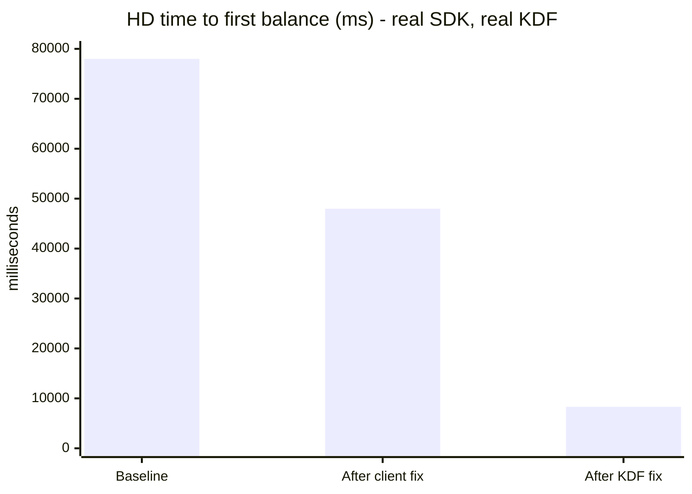
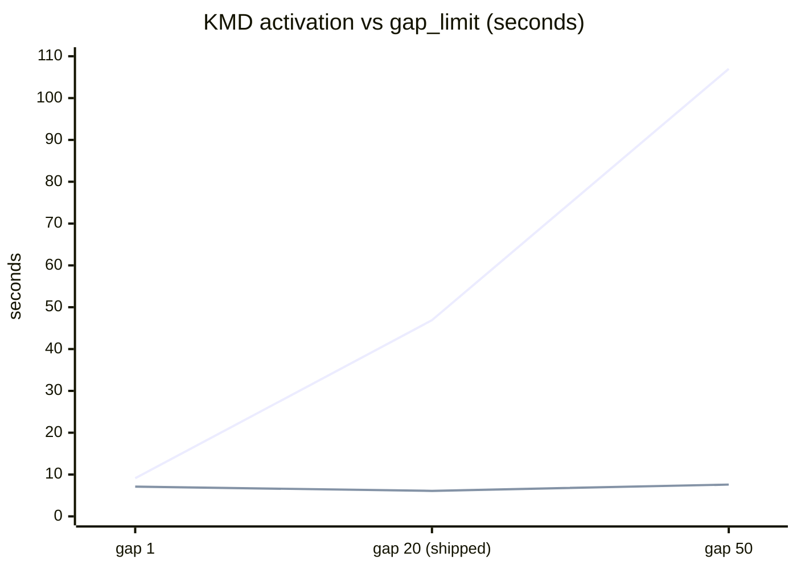

# Wallet-load performance: what changed and what each change bought

Users reported balances taking **minutes** to appear after login. This accounts
for every change made, what each one is worth in seconds, and what is still
slow.

Method and raw data: [`KDF_LATENCY_REPORT.md`](KDF_LATENCY_REPORT.md).
Source analysis: [`KDF_IMPROVEMENT_OPPORTUNITIES.md`](KDF_IMPROVEMENT_OPPORTUNITIES.md).

---

## TL;DR

**Time to first balance on a fresh HD wallet: 78.0s → 8.3s (9.4×)**, measured
through the real SDK against a real KDF.

| stage | first balance | Δ | what changed |
|---|---:|---:|---|
| baseline | 77,986ms | — | — |
| after client fix | 47,986ms | **−30,000ms** | stop issuing a second address scan |
| after KDF fix | **8,303ms** | **−39,683ms** | probe the address gap concurrently |

Two changes on that path, both accounted for, no unexplained remainder.

**Two more landed afterwards, on the EVM/TRON path**, which the table above does
not touch:

| | before | after | |
|---|---:|---:|---|
| `enable_eth_with_tokens`, ETH + 2 ERC-20, first-time HD | 212.1s | **27.3s** | **7.8×** |
| EVM round trip, median / p90 | 246 / 379ms | **207 / 245ms** | connection pooling |

Five changes in total: **C1** stop scanning addresses twice (client), **K1**
probe the address gap concurrently (KDF), **K2** stop holding the RPC pool lock
across the round trip (KDF), **K3** a connection-pooling HTTP client (KDF), and
**K4** absorb a rate-limited node instead of dying on it (KDF).

K4 is not a speedup — it is what makes K2 shippable. K2's concurrency budget
broke activation outright for every EVM coin with a single RPC node, GLEEC
included, and GLEEC is in `enabledByDefaultCoins`. See [K4](#k4--kdf-absorb-a-rate-limited-node-instead-of-dying-on-it).

**The app default set, HD, end to end: 49.83s** (median of three, 49.51-51.96),
measured with K4 in place. It could not be measured before K4 because GLEEC is
in that set and failed 100% of the time.

---

## How this was measured

Three independent paths, so no claim rests on one tool:

| tier | what is in the loop | answers |
|---|---|---|
| `tool/kdf_latency_probe.py` | Python stdlib → HTTP → KDF binary | is it KDF or is it us? (no Flutter/Dart/SDK exists in that process) |
| `komodo_defi_harness` process tier | the **real SDK** + a real KDF | what the app actually experiences |
| `tool/web/kdf_web_probe.html` | plain JS → KDF WASM | does the same hold on web |

All numbers use the public BIP39 vector `abandon … about`.

**On UTXO and TRON these are a floor** — that seed is unused there, so a wallet
with history does more work, not less.

**The ETH rows are the opposite: a ceiling.** It is the most-used public test
vector in existence, so on Ethereum the gap scan keeps finding *used* addresses
and walks 239 of them rather than the 21 an empty account needs — and a used
address costs roughly double, because `AddressBalanceStatus::Used` adds a full
`known_address_balance` on top of the probe. A real user's ETH wallet does
**less** work than these numbers, not more. An earlier version of this document
claimed "floor" for everything; that was wrong.

---

## The changes

### C1 — Client: stop scanning addresses twice

`PubkeyManager` issued `task::scan_for_new_addresses` immediately after an
activation that had already walked the same gap. It hit its 20s ceiling every
time and the result was discarded.

Skipped when — and only when — the activation happened this session **and** the
protocol's params actually carry a scan policy. `UtxoProtocol` sends
`scan_policy: scan_if_new_wallet`; the ETH-family params have no `scan_policy`
field at all, so ETH must still scan.

**Worth −30,000ms.** Scan polls 80 → 0, and `account_balance` polls 210 → 8,
because the two had been contending.

### K1 — KDF: probe the address gap concurrently

`scan_for_new_addresses_impl` awaited one `is_address_used` per address, so the
shipped `gap_limit: 20` cost **2 × 21 = 42 strictly serialized round trips per
coin**. On a brand-new wallet — which has nothing to find — that was the whole
of activation.

It now probes in **windows** sized to exactly the number of consecutive unused
addresses still needed to end the walk, so it never probes an address the
sequential walk would not have; it just stops waiting for each answer before
asking the next question. Results are consumed in order, driving the identical
state machine.

**Worth −39,683ms** on first balance, and it is the change that removes the
`gap_limit` cost entirely:

Upper line before, lower line after. **The slope is gone**: 107.0s → 7.6s at
gap 50. `gap_limit` becomes a correctness choice rather than a latency one — KDF
could now raise the default rather than clients lowering it.

Equivalence is pinned by `test_scan_for_new_addresses`, which asserts the exact
*ordered* list of probed addresses and the resulting counts across two chains
and two accounts. It passes **unchanged**.

### K1a — a consequence, not a separate change

`task::account_balance` fell **21.6s → 1.4s with no change to its code**. It had
been blocking on the whole-wallet `HDAccountsMutex` held by the still-running
scan. Shorten the scan and it evaporates — which was predicted before the
measurement, and is why a separate fix for it was *not* funded.

---

## Per-coin effect

```mermaid
xychart-beta
    title "Activation time by coin (seconds), before vs after"
    x-axis ["KMD", "BTC-segwit", "4 UTXO coins"]
    y-axis "seconds" 0 --> 280
    bar [46.9, 121.2, 260.9]
    bar [6.1, 8.2, 21.7]
```

| scenario | before | after | |
|---|---:|---:|---|
| KMD activate | 46.9s (94 polls) | **6.1s** (13 polls) | 7.7× |
| BTC-segwit activate | 121.2s | **8.2s** | 14.8× |
| 4 UTXO coins | 260.9s | **21.7s** | 12.0× |
| `scan_for_new_addresses` | 20.1s, **timed out** | **2.3s**, completes | fixed |
| `account_balance` | 21.6s (208 polls) | **1.4s** (14 polls) | 15.9× |
| single-coin total | 89.8s | **10.2s** | 8.8× |
| iguana, 1 coin *(control)* | 2.0s | 2.0s | unchanged ✓ |
| `do_not_scan` *(control)* | 2.0s | 2.0s | unchanged ✓ |

Both controls are unchanged, which is what rules out "everything got faster
because the network was better today".

---

## The realistic login, fully accounted

The app's own `enabledByDefaultCoins` — 8 assets, 5 activation RPCs:

| asset | before | after | Δ |
|---|---:|---:|---:|
| GLEEC | 12.2s | 10.5s | −1.7s |
| KMD | 47.0s | 6.1s | **−40.9s** |
| BTC-segwit | 121.2s | 8.2s | **−113.0s** |
| TRX + 1 token | 41.0s | 33.5s | −7.5s |
| **ETH + 2 tokens** | 246.1s | **342.3s** | **+96.2s** |
| activations | 467.5s | 400.6s | −66.9s |
| **scenario total** | **480.7s** | **411.6s** | −69.1s (−14.4%) |

Split by family, this is the whole story:

* **UTXO: 180.4s → 24.8s (7.3×)** — the fix working exactly as designed.
* **EVM: 287.1s → 375.8s** — went the *wrong way* in this sample. See below.

The eight-minute login is now a seven-minute login, and **every second of the
remainder is EVM**.

---

## EVM: what did not improve under C1+K1, and what fixed it

`enable_eth_with_tokens` is a single **synchronous** RPC — no task id, no
progress, no partial result — and it does HD address discovery inline.

The scan fix is on its path, so it should have helped. It did not, reliably.
Three alternating A/B rounds:

| | samples | min | median | max |
|---|---|---:|---:|---:|
| before | 3 | 343.3s | 343.4s | 363.8s |
| after | 3 | **196.9s** | 219.0s | 346.4s |

The baseline is tight; the fixed build is **bimodal** — sometimes ~40% better,
sometimes not at all, **never worse**. The `+96.2s` in the table above is a
single draw from that distribution, not a regression.

**Why:** every EVM RPC funnels through one mutex. `try_rpc_send` holds
`web3_instances.lock()` across the network round trip, so **at most one EVM RPC
is ever in flight per coin**. Concurrency added above it is absorbed.

~343s held flat across the baseline samples, which read at the time as a
ceiling concurrency could not break. It was not one.

### Where the time actually went

An earlier draft of this document called ~85% of EVM per-RPC cost
"unexplained", reasoning that HD implied ~4.2s per round trip against iguana's
~0.6s and that no mutex can slow an individual round trip. **That was a wrong
denominator, and the conclusion drawn from it was wrong.**

Measured with per-call tracing rather than inferred:

| | measured |
|---|---:|
| RPCs in one first-time HD activation of ETH + 2 ERC-20 | **1208** (1160 on the call; 1208 / 1207 / 1086 across three rounds) |
| median round trip | **238ms** — healthy |
| failovers | 1 in 1208 |
| wire time / wall clock | **289s inside 292s** |

289 of 292 seconds with exactly one request on the wire. Nothing was rate
limited and no round trip was slow; the mutex serialized ~1200 healthy
requests. The ~4.2s figure came from dividing by an *assumed* ~87 RPCs — off by
a factor of 14.

**Why ~1200 and not ~87:** the scan issues one `eth_getTransactionCount` per
address probed, and the trace shows **239** of them. It walked 239 addresses,
not the 21 an empty account needs — because `abandon … about` is the most-used
public test vector there is, so on Ethereum the gap scan keeps finding *used*
addresses and walks on. A used address also costs roughly double, since
`AddressBalanceStatus::Used` adds a full `known_address_balance` on top of the
probe. See the caveat in [How this was measured](#how-this-was-measured): the
ETH rows are a **ceiling**, not a floor.

---

### K2 — KDF: stop holding the RPC pool lock across the round trip

`try_rpc_send` held `web3_instances.lock().await` for the whole function,
because the LRU reorder at the end (`clients.rotate_left(i)`) needed `&mut`.
The node list is now immutable and shared, and the "which node first" state is
an `AtomicUsize` cursor — a cursor rather than a rotation because `i` indexes a
snapshot and means nothing once the guard is dropped. `get_live_client` had the
same shape and was worse, holding the lock across a 30s-per-node
`client_version` probe. TRON's `TronApiClient` held the identical pattern, with
a comment calling it deliberate "for consistency with EVM's `try_rpc_send`" —
it was worse than the thing it matched, being Clone-shared across every TRON
coin rather than per-coin.

Concurrency is bounded by a permit budget (default 12, override
`KDF_EVM_RPC_MAX_CONCURRENCY`) which exists to protect the *nodes*, not any
invariant of ours.

**Measured**, three alternating rounds, `enable_eth_with_tokens` for ETH + 2
ERC-20 on a first-time HD activation:

| | baseline | after | |
|---|---:|---:|---|
| median | 212.1s | **27.3s** | **7.8×** |
| wire-time median per RPC | 238ms | 243ms | unchanged — it was never the round trips |

**TRON gets the same fix and the same shape of win.** `TronApiClient` was
Clone-shared across every TRON coin, so one mutex serialized TRX balances, every
TRC-20 `balanceOf`, TAPOS, energy estimates, broadcasts and the HD gap probes
alike. Measured on `TRX + USDT-TRC20`, HD, gap 20, seven alternating runs per
arm (medians):

| step | baseline | after | |
|---|---:|---:|---|
| `enable_eth_with_tokens` | 35.7s | **5.2s** | 6.9× |
| `scan_for_new_addresses` | 10.3s | **1.3s** | 7.9× |
| `account_balance` | 20.1s | **1.8s** | 11.2× |
| **total, excl. boot** | **68.1s** | **8.4s** | **8.1×** |

The sample ranges do not overlap — 35.0-122.6s against 4.5-6.9s — and the
baseline's worst run was 3.5× its best, which is the same fragility signature
described below.

It also removes that fragility: activation used to be a linear function of
per-RPC latency, so an endpoint having a slow hour turned a 212s login into a 331s one.
That is the whole explanation for the bimodal spread recorded above, which this
document previously listed as cause unknown. Post-fix it does not track
endpoint latency at all.

**Four faults the mutex was hiding**, all reachable only once requests run
concurrently, all fixed with it:

* `stop_connection_loop` pushed `Close` into an unbounded channel and the loop
  consumed exactly one before exiting, so concurrent failures left surplus
  `Close`es that killed the *next* loop the moment it spawned. `Close` now
  carries the connection generation it was aimed at.
* The socket was torn down on **any** error, including ordinary JSON-RPC ones.
  Transports are `Arc`-shared across a platform coin and every token on it, so
  one reverted `eth_call` failed every other request riding that socket.
* `maybe_spawn_connection_loop` probed liveness with a `try_lock` it released
  before spawning, so concurrent callers all saw a free guard and all spawned.
  All but one parked on the guard forever, and a parked future never completes,
  so its abortable-queue slot was never released.
* The ERC-20 `decimals()`/`symbol()` getters went through `EthCoin::web3()`,
  which hands back a single transport with **no failover**, so one rate-limited
  response aborted the whole activation. **Pre-existing** — it fires on
  unmodified code, roughly one activation in six under the endpoint conditions
  measured — and made worse by the extra 429s concurrency provokes. Now routed
  through the pool.

**Telemetry**, because the pool fails over silently and none of the above was
visible: `evm_rpc_failover` on any endpoint that did not answer (always on,
carries the HTTP status), and a full per-call `evm_rpc` breakdown behind
`KDF_EVM_RPC_TRACE=1`. Both log host and port only — several shipped EVM
providers carry an API key in the URL.

### K3 — KDF: a connection-pooling HTTP client

`HYPER`'s `pool_max_idle_per_host(0)` does more than skip keep-alive: in hyper
0.14 it makes `Pool::inner` `None`, which also switches off HTTP/2 connection
sharing and the connect-dedup that goes with it. Every request paid DNS + TCP +
TLS, and concurrent requests to one host each paid their own, even though the
connector negotiates h2 and would happily multiplex.

Added as a **separate** pooled client rather than by changing `HYPER`, which
has ~32 call sites including the UTXO native client — flipping it globally
would have been an untested behaviour change well outside this work.

| | before | after |
|---|---:|---:|
| median round trip | 246ms | **207ms** |
| p90 | 379ms | **245ms** |

### K4 — KDF: absorb a rate-limited node instead of dying on it

K2's permit budget (12 concurrent per pool) broke **GLEEC**, which is in
`enabledByDefaultCoins` — so it broke every login. It has **one** RPC node, and
with one node "every node refused" and "the node said no once" are the same
event: `try_rpc_send` returned the first error, and its caller is a
`try_collect` over the HD address gap scan, so a single refused probe failed the
whole activation. Measured 6/6 failures at ~1.1s.

**The limit is a rate, not a concurrency**, which is what made the first
diagnosis land on the wrong quantity. Measured directly against
`evm-rpc.gleec.com`: a burst of 12 requests at one instant is served cleanly,
but a *sustained* 12-in-flight is ~55 requests/second at a 220ms round trip, and
the endpoint serves ~20/s. It answered exactly 120 requests in a six-second
window whether offered 55/s or 32/s. A budget of C is a rate of C/R, and only
the rate matters.

Three changes: retry with jittered exponential backoff when every node refused
(bounded, outside the node loop, so healthy pools never reach it); the HTTP
status carried as `TransportError::Code` on **both** targets instead of
string-matched out of a message only the native arm produced; and a budget that
adapts down under sustained refusal and back up afterwards.

**The budget is not capped per chain, and that was measured rather than
assumed.** A sweep of 33 activations across budgets from 2 to 48, on a one-node
chain and a four-node one, found every arm succeeding with zero
`evm_rpc_exhausted` — GLEEC survives four times the default budget on a single
node. Reliability comes from the retry, not the cap. Throttling also proved
counterproductive: GLEEC's slowest arm was budget 2, the setting that provokes
no 429s at all, because it trades each refusal for a round trip it waits on
instead. Details in
[`KDF_IMPROVEMENT_OPPORTUNITIES.md`](KDF_IMPROVEMENT_OPPORTUNITIES.md).

The wasm half is not incidental. This endpoint's 429 comes from Cloudflare's
edge with no `Access-Control-Allow-Origin`, so in a browser `fetch` rejects with
an opaque error and **the status never exists**. Anything keyed on reading `429`
is dead code on web. The retry therefore triggers on transport failure and
treats the status as description, never as the decision.

**Measured**, three alternating rounds per arm, same seed and servers, fresh
KDF and database per run:

| scenario | `34ab0e7` | with K4 | |
|---|---|---|---|
| GLEEC, HD (activation total) | **FAIL 3/3** at 1.5-1.9s | **7.64s** (7.40-7.98) | works |

GLEEC was then re-run **10 consecutive times against the final binary** — the
one built from the committed tree, not the one the A/B used, because a bug fix
landed between them: **10/10 pass**, median 7.6s, worst 10.46s, all inside its
pre-regression 11.44s.

Re-verified again after the per-chain cap was removed, so these numbers describe
the shipped behaviour rather than a throttled variant: GLEEC **10/10** (median
8.7s, worst 10.45s), **web 9.6s**, app default set **48.92s** (48.85–51.58).
| app default set, HD, `--p2p` | **FAIL 3/3** | **49.83s** (49.51-51.96) | works |
| ETH + 2 ERC-20, HD (`enable_eth_with_tokens`) | 20.60s (20.47-21.33) | 20.96s (20.62-21.07) | **+1.7%, noise** |
| TRX + USDT-TRC20, HD (whole path) | 8.70s (8.70-9.40) | 9.16s (8.53-11.47) | +5.3% |

The ETH row is the one that had to hold, and it does: K2's 7.8× is intact and
the change costs it 0.36s against a 0.86s spread. GLEEC lands under its
pre-regression `ed8de23` time of 11.44s.

The TRX numbers were taken while a wasm build was competing for CPU, and its
one slow draw (11.47s against 8.53s and 9.16s) is the whole difference; the
other two runs are indistinguishable from the baseline. Both arms are within
the 10s target on the median.

**It is not a GLEEC-only fault.** During these runs `34ab0e7` also failed a
**TRX** activation outright — two nodes, both refusing at once — with the same
`No such coin` signature. The shipped config has 5 single-node EVM coins and 33
two-node ones; the fault needs one simultaneous refusal per node.

---

## Correctness fixes in the same work

Not performance, but found while measuring and worth recording:

* **`hydratedPubkeys` could return the previous wallet's pubkeys** — it read the
  cache before the call whose side effect clears it on a wallet switch, and
  `BalanceManager` paints a balance straight from that.
* **A silent progress stream hung the caller forever** — the activation future
  was returned after the event loop, so a stream that never emits *and* never
  closes suspended before the caller ever received it.
* **KDF panicked on TRX/NFT activation with P2P disabled** — an `unwrap()` on a
  context fetched before checking whether it was needed. Fatal on wasm32, which
  is what the web wallet runs.
* **`GetPublicKeyHashRequest` could never be serialised** — `<JsonMap>{}` is an
  empty *Set*, which `jsonEncode` refuses. Present since 2024.
* **The activation deadline was below measured reality** — a flat 60s fired
  mid-activation on every fresh HD login and the retry issued a duplicate
  concurrent enable. Now protocol-aware.

---

## Keeping it

`first_post_activation_balance_ms` is compared against a committed baseline on
every PR (`komodo_defi_harness`, 30% regression threshold). Current: **+1.9%
(hd)**, **+0.6% (iguana)**.

That is the part that stops this silently regressing — the numbers above are
only durable because something checks them on every change.
