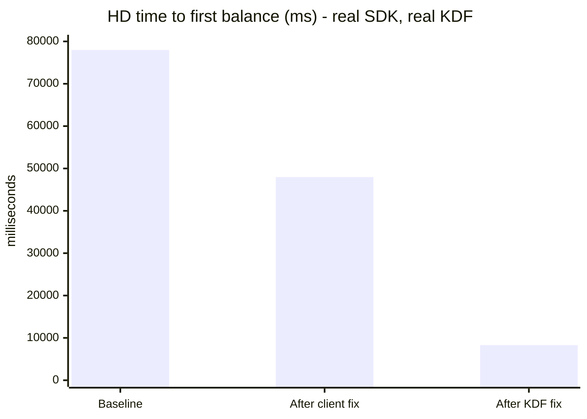
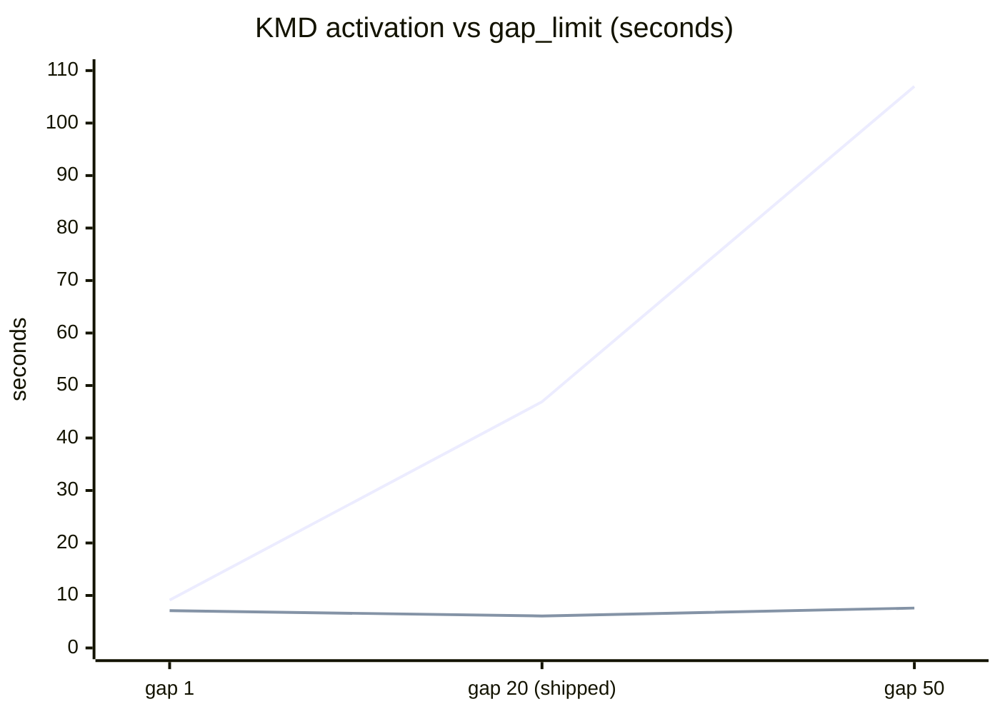

# Wallet-load performance: what changed and what each change bought

Users reported balances taking **minutes** to appear after login. This accounts
for every change made, what each one is worth in seconds, and what is still
slow.

Method and raw data: [`KDF_LATENCY_REPORT.md`](KDF_LATENCY_REPORT.md).
Source analysis: [`KDF_IMPROVEMENT_OPPORTUNITIES.md`](KDF_IMPROVEMENT_OPPORTUNITIES.md).

---

## TL;DR

**Time to first balance on a fresh HD wallet: 78.0s → 8.3s (9.4×)**, measured
through the real SDK against a real KDF.

| stage | first balance | Δ | what changed |
|---|---:|---:|---|
| baseline | 77,986ms | — | — |
| after client fix | 47,986ms | **−30,000ms** | stop issuing a second address scan |
| after KDF fix | **8,303ms** | **−39,683ms** | probe the address gap concurrently |

Two changes, both accounted for, no unexplained remainder.

---

## How this was measured

Three independent paths, so no claim rests on one tool:

| tier | what is in the loop | answers |
|---|---|---|
| `tool/kdf_latency_probe.py` | Python stdlib → HTTP → KDF binary | is it KDF or is it us? (no Flutter/Dart/SDK exists in that process) |
| `komodo_defi_harness` process tier | the **real SDK** + a real KDF | what the app actually experiences |
| `tool/web/kdf_web_probe.html` | plain JS → KDF WASM | does the same hold on web |

All numbers use the public zero-funds BIP39 vector `abandon … about`, so they
are a **floor** — a wallet with history does more work, not less.

---

## The changes

### C1 — Client: stop scanning addresses twice

`PubkeyManager` issued `task::scan_for_new_addresses` immediately after an
activation that had already walked the same gap. It hit its 20s ceiling every
time and the result was discarded.

Skipped when — and only when — the activation happened this session **and** the
protocol's params actually carry a scan policy. `UtxoProtocol` sends
`scan_policy: scan_if_new_wallet`; the ETH-family params have no `scan_policy`
field at all, so ETH must still scan.

**Worth −30,000ms.** Scan polls 80 → 0, and `account_balance` polls 210 → 8,
because the two had been contending.

### K1 — KDF: probe the address gap concurrently

`scan_for_new_addresses_impl` awaited one `is_address_used` per address, so the
shipped `gap_limit: 20` cost **2 × 21 = 42 strictly serialized round trips per
coin**. On a brand-new wallet — which has nothing to find — that was the whole
of activation.

It now probes in **windows** sized to exactly the number of consecutive unused
addresses still needed to end the walk, so it never probes an address the
sequential walk would not have; it just stops waiting for each answer before
asking the next question. Results are consumed in order, driving the identical
state machine.

**Worth −39,683ms** on first balance, and it is the change that removes the
`gap_limit` cost entirely:

Upper line before, lower line after. **The slope is gone**: 107.0s → 7.6s at
gap 50. `gap_limit` becomes a correctness choice rather than a latency one — KDF
could now raise the default rather than clients lowering it.

Equivalence is pinned by `test_scan_for_new_addresses`, which asserts the exact
*ordered* list of probed addresses and the resulting counts across two chains
and two accounts. It passes **unchanged**.

### K1a — a consequence, not a separate change

`task::account_balance` fell **21.6s → 1.4s with no change to its code**. It had
been blocking on the whole-wallet `HDAccountsMutex` held by the still-running
scan. Shorten the scan and it evaporates — which was predicted before the
measurement, and is why a separate fix for it was *not* funded.

---

## Per-coin effect

```mermaid
xychart-beta
    title "Activation time by coin (seconds), before vs after"
    x-axis ["KMD", "BTC-segwit", "4 UTXO coins"]
    y-axis "seconds" 0 --> 280
    bar [46.9, 121.2, 260.9]
    bar [6.1, 8.2, 21.7]
```

| scenario | before | after | |
|---|---:|---:|---|
| KMD activate | 46.9s (94 polls) | **6.1s** (13 polls) | 7.7× |
| BTC-segwit activate | 121.2s | **8.2s** | 14.8× |
| 4 UTXO coins | 260.9s | **21.7s** | 12.0× |
| `scan_for_new_addresses` | 20.1s, **timed out** | **2.3s**, completes | fixed |
| `account_balance` | 21.6s (208 polls) | **1.4s** (14 polls) | 15.9× |
| single-coin total | 89.8s | **10.2s** | 8.8× |
| iguana, 1 coin *(control)* | 2.0s | 2.0s | unchanged ✓ |
| `do_not_scan` *(control)* | 2.0s | 2.0s | unchanged ✓ |

Both controls are unchanged, which is what rules out "everything got faster
because the network was better today".

---

## The realistic login, fully accounted

The app's own `enabledByDefaultCoins` — 8 assets, 5 activation RPCs:

| asset | before | after | Δ |
|---|---:|---:|---:|
| GLEEC | 12.2s | 10.5s | −1.7s |
| KMD | 47.0s | 6.1s | **−40.9s** |
| BTC-segwit | 121.2s | 8.2s | **−113.0s** |
| TRX + 1 token | 41.0s | 33.5s | −7.5s |
| **ETH + 2 tokens** | 246.1s | **342.3s** | **+96.2s** |
| activations | 467.5s | 400.6s | −66.9s |
| **scenario total** | **480.7s** | **411.6s** | −69.1s (−14.4%) |

Split by family, this is the whole story:

* **UTXO: 180.4s → 24.8s (7.3×)** — the fix working exactly as designed.
* **EVM: 287.1s → 375.8s** — went the *wrong way* in this sample. See below.

The eight-minute login is now a seven-minute login, and **every second of the
remainder is EVM**.

---

## What did not improve: EVM

`enable_eth_with_tokens` is a single **synchronous** RPC — no task id, no
progress, no partial result — and it does HD address discovery inline.

The scan fix is on its path, so it should have helped. It did not, reliably.
Three alternating A/B rounds:

| | samples | min | median | max |
|---|---|---:|---:|---:|
| before | 3 | 343.3s | 343.4s | 363.8s |
| after | 3 | **196.9s** | 219.0s | 346.4s |

The baseline is tight; the fixed build is **bimodal** — sometimes ~40% better,
sometimes not at all, **never worse**. The `+96.2s` in the table above is a
single draw from that distribution, not a regression.

**Why:** every EVM RPC funnels through one mutex. `try_rpc_send` holds
`web3_instances.lock()` across the network round trip, so **at most one EVM RPC
is ever in flight per coin**. Concurrency added above it is absorbed.

~343s looks like a ceiling that concurrency cannot break through — consistent
with the mutex being the binding constraint.

**Honest gap:** ~85% of EVM per-RPC cost is still unexplained. HD implies ~4.2s
per round trip, iguana ~0.6s, same binary and nodes. A mutex cannot slow an
individual round trip. Most likely endpoint rate limiting or failover against
the 10s node timeout — which, if true, partly self-defeats the fix below.

**Expected from the deferred work** (see
[`HANDOFF_EVM_ACTIVATION_LATENCY.md`](HANDOFF_EVM_ACTIVATION_LATENCY.md)):

| change | expected | confidence |
|---|---|---|
| release the mutex before the round trip | ~90s off 363.8s (25%) | medium-high |
| pooled Hyper client for the EVM transport | ~13–26s (4–7%) | medium |

Not additive — the handshake cost is part of the per-RPC cost the first
estimate holds constant.

---

## Correctness fixes in the same work

Not performance, but found while measuring and worth recording:

* **`hydratedPubkeys` could return the previous wallet's pubkeys** — it read the
  cache before the call whose side effect clears it on a wallet switch, and
  `BalanceManager` paints a balance straight from that.
* **A silent progress stream hung the caller forever** — the activation future
  was returned after the event loop, so a stream that never emits *and* never
  closes suspended before the caller ever received it.
* **KDF panicked on TRX/NFT activation with P2P disabled** — an `unwrap()` on a
  context fetched before checking whether it was needed. Fatal on wasm32, which
  is what the web wallet runs.
* **`GetPublicKeyHashRequest` could never be serialised** — `<JsonMap>{}` is an
  empty *Set*, which `jsonEncode` refuses. Present since 2024.
* **The activation deadline was below measured reality** — a flat 60s fired
  mid-activation on every fresh HD login and the retry issued a duplicate
  concurrent enable. Now protocol-aware.

---

## Keeping it

`first_post_activation_balance_ms` is compared against a committed baseline on
every PR (`komodo_defi_harness`, 30% regression threshold). Current: **+1.9%
(hd)**, **+0.6% (iguana)**.

That is the part that stops this silently regressing — the numbers above are
only durable because something checks them on every change.
